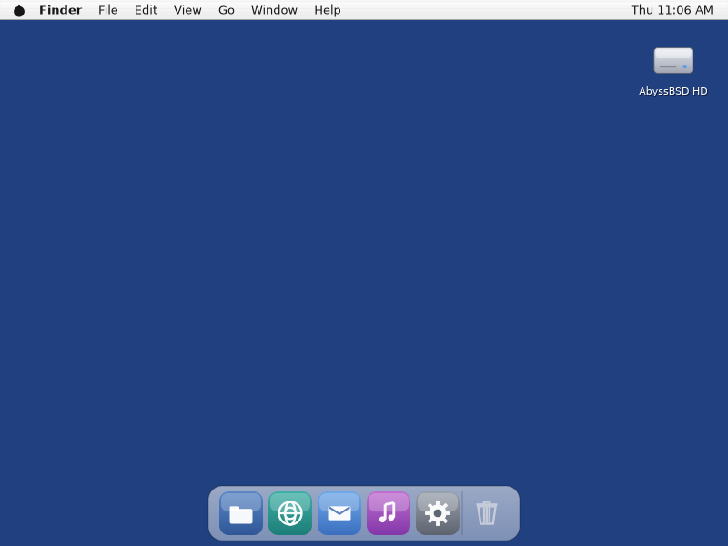
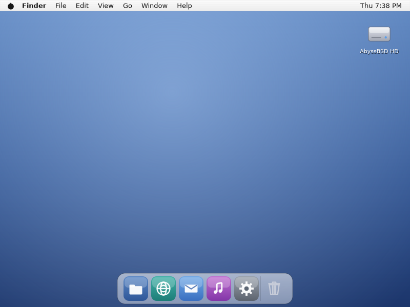

# Phase 3 — FreeBSD bring-up (scope)

Expands PLAN.md §"Phase 3" from milestone sketch to executable detail, grounded in
a read of the Rust sibling's supervisor (`anchor`), hardware bridges (`vents`) and
IPC (`current`), and in a survey of this repo's own Linux-isms. Read
[PLAN.md](PLAN.md) for the locked decisions, [PHASE2.md](PHASE2.md) for the shell
this phase moves onto FreeBSD, and [HANDOFF.md](HANDOFF.md) for the traps.

Last updated: 2026-07-27.

**Phase 3 is COMPLETE — P3.1–P3.7 all shipped.** The Jaguar desktop runs on
FreeBSD under a Swift session supervisor, with a Swift control plane and Swift
hardware bridges underneath it; the whole test harness passes on the target
(33/33 live modes, 105 unit tests); and the project's standing #1 risk — Swift
on FreeBSD — is closed. Phase 2 left the Aqua shell — desktop,
menu bar, Dock, Finder, icons, launching — running on Linux against stock sway
and booting with one command (`abyss/session.sh`). Phase 3 makes it run **on
FreeBSD**, and gives it the native substrate underneath that Linux has been
standing in for. P3.1 built the box and found that **ports carries
`swift6-6.3.2`** — newer than our Linux toolchain. P3.2 built this repo with it
(**62/62 tests**, one `Package.swift` change, no source changes;
[SWIFT-ON-FREEBSD.md](SWIFT-ON-FREEBSD.md) is closed). P3.3 ran it:


P3.4 then got the harness green there — all 31 live modes and the supervised
session — and P3.5 built the **control plane** (`CurrentIPC`): typed messages
over unix sockets, handing real file descriptors between processes, with our own
codec rather than libnv. P3.6 then replaced `abyss/session.sh` with **`anchor`**,
the Swift supervisor — every child a pollable descriptor, a control service, and
a session that tears down as a unit. P3.7 finished the substrate with the
**hardware bridges** (`vents`: sysctl, OSS, devd) and the menu bar's status
items:


**What Phase 3 set out to do is done.** What it deliberately did not do is
unchanged: no compositor (Phase 6), no portals or legacy D-Bus bridge (§6.1,
carved out), no Mac Pro (Phase 4).

---

## 1. Scope boundary (what Phase 3 is and is NOT)

**Phase 3 = the Swift Aqua desktop running natively on FreeBSD 15, on a stock
wlroots compositor from ports, with its own Swift control plane, session
supervisor and hardware bridges underneath.** Two halves, in order:

1. **Bring-up** — the VM, the Swift toolchain (the standing #1 risk, **closed in
   P3.2**), the C substrate, and every portability debt Phase 1–2 deliberately
   deferred. Ends with a screenshot of the Jaguar desktop taken *inside FreeBSD*.
2. **The native substrate** — `CurrentIPC`, a Swift session supervisor
   (`anchor`'s job, replacing `abyss/session.sh`), and the Swift hardware bridges
   (`vents`' job) that finally make the menu bar's volume and battery real.

Everything is a **Swift rewrite read from the sibling as a spec**, never a link
against it (PLAN.md, corrected 2026-07-27). `PoolConfig` is the pattern.

**Explicitly NOT in Phase 3:**

- **No compositor work.** The shell runs as clients against **stock sway/labwc**,
  which FreeBSD ports the same as Linux does. A Swift compositor is Phase 6, and
  nothing here waits on it. What that costs us is unchanged from Phase 2 and
  documented: a client can't position its own windows, so spatial Finder
  positions and desktop-icon dragging stay out of reach (HANDOFF §2.22).
- **No portals, no D-Bus bridge, no XWayland.** PLAN.md files "the D-Bus
  replacement story" under Phase 3; it is **carved out to its own phase**
  (decided 2026-07-27, §6.1). The reason is sequencing, not doubt: the sibling's
  portal design is *compositor-owned* (`reef-portal` lives in `tide`), and we
  won't own a compositor until Phase 6. A client-side subset is feasible on sway
  (a Finder-backed file chooser; screenshots via `wlr-screencopy`), but it is a
  phase of work, not a pass, and it does not gate FreeBSD.
- **No Mac Pro, no GPU.** Phase 4. Everything here is verified in the qemu/KVM
  VM under sway's **headless** backend, exactly as Phase 2 was on Linux.
- **No `shmring`.** It exists in the sibling for the compositor's hot path. We
  have no compositor and no measured need; if one appears, it's a pass then.

---

## 2. What we already have vs. what's new

| Need | Have (Phase 1–2) | New (Phase 3) |
|---|---|---|
| Toolkit, shell, client runtime | `Aqua`, `Surface`, the five shell components | — (they *port*, they don't get rewritten) |
| Config | `PoolConfig` + `CPoolWatch` (kqueue branch **written, never compiled**) | first FreeBSD build + test of the kqueue half |
| Session launch | `abyss/session.sh` (POSIX sh, supervises + tears down) | ✅ **`anchor`**, the Swift supervisor (P3.6) |
| Control plane | — | ✅ **`CurrentIPC`** (carried from P2.9, built in P3.5) |
| Hardware (volume, battery, hotplug) | — (menu bar has no status items) | ✅ **`Vents`** — sysctl / OSS / devd, with menu-bar status items (P3.7) |
| Build + test host | this Linux box | the **FreeBSD VM** + an in-guest test lane |
| Swift toolchain | 6.3.1 on Linux | ✅ ports `swift6-6.3.2` in the guest — was the #1 risk, [closed in P3.2](SWIFT-ON-FREEBSD.md) |

The shell itself is the part that should need the least work — it is deliberately
POSIX-and-Wayland all the way down. The Linux-isms were few and already known,
and **P3.2 settled all but one of them at a cost of one `Package.swift` edit**:

| Debt | Where | Outcome |
|---|---|---|
| `/usr/local` prefix | `Package.swift` — `CWayland` linked `wayland-client` with **no** pkgConfig | ✅ **the only real fix**: a `CWaylandClient` systemLibrary with `pkgConfig: "wayland-client"`, which `CWayland` depends on (P3.2) |
| `#if canImport(Glibc)` | ~20 Swift files | ✅ free — Swift names the platform libc module **`Glibc`** on FreeBSD too, so every guard was already right |
| inotify | `de/cpoolwatch/cpoolwatch.c` | ✅ the kqueue branch compiled and **passed its test** — first execution anywhere |
| `memfd_create` | `aw_create_shm` | ✅ the `SHM_ANON` branch compiled, likewise never built before |
| `timerfd` | `aw_create_interval_timer` (the menu-bar clock) | ✅ free — FreeBSD 15 has native `timerfd(2)`; no `EVFILT_TIMER` fallback needed |
| `_GNU_SOURCE` | `de/cwayland/cwayland_shm.c:1` | ✅ harmless — compiles clean |
| `/proc/self/exe` | `Launcher.selfExecutable` | ✅ **paid (P3.3)** — the new `CPlatform` C shim (`ap_self_executable`): `KERN_PROC_PATHNAME` there, `/proc/self/exe` here. Swift can't see `<sys/sysctl.h>` at all |
| epoll-over-kqueue | FreeBSD's libwayland (`wayland-client.pc` adds `-I/usr/local/include/libepoll-shim`) | ✅ **a non-event (P3.3)** — the client maps, paints and keeps frame callbacks with no run-loop change |
| bold/italic fonts | `de/ctext/ctext.c` style lists | ✅ **found and fixed in P3.3** — only the *regular* list had a FreeBSD path, so styled runs silently fell back to regular. A bug that could only exist on the target |

---

## 3. Component map (sibling → ours)

| Job | Sibling analog | Ours | Notes |
|---|---|---|---|
| Session supervisor | `anchor` (456 LOC) | `Anchor` + `anchor` — **done** (P3.6) | `pdfork` on FreeBSD / `pidfd` on Linux, both pollable; hosts a control service |
| Control plane | `current` (551 LOC) | `CurrentIPC` — **done** (P3.5) | unix sockets, typed messages, `SCM_RIGHTS`; our own codec, no libnv |
| Hardware bridges | `vents` (658 LOC: sysctl 127, oss 86, devd 314) | `Vents` — **done** (P3.7) | `sysctlbyname`, `/dev/mixer` ioctls, the devd socket |
| Config | `pool` (458 LOC) | `PoolConfig` — **done** (P2.3) | the pattern the rest follow |
| Compositor | `tide` (11,573 LOC) | Phase 6 | stock sway/labwc from ports until then |
| Portals | `reef-portal` (in `tide`) | carved out (§6.1) | compositor-owned in the sibling; needs Phase 6 or a client-side subset |

The sibling's crates are ~1,700 LOC total for the three we rewrite here — small,
FreeBSD-specific, and well-documented. That is why they're a rewrite and not a
port: the value is in the *design* (`anchor`'s descriptor-as-handle discipline,
`vents`' choice of native facilities over Linux ones), and it reads in an hour.

---

## 4. Ordered passes (recommended)

One build→verify→test→doc→commit pass each, as in Phase 2, with the pass number
in the commit subject. P3.2 gated P3.3–P3.4 and P3.6–P3.7 — **that gate is now
open**: Swift builds and tests this repo on FreeBSD, so every remaining pass is
verifiable on the target rather than only on Linux. (P3.5 never depended on it;
§6.3.)

**P3.1 — The build VM + a corrected seed. ✅ done.**
A fresh `../abyss-swift-vm` (FreeBSD 15.0-RELEASE-p11) now provisions from a
corrected seed and is asserted usable by a new **`abyss/vm/check.sh`**. The
sibling's `../abyss-vm` is untouched. What changed:

- **The seed no longer installs Rust.** It was there "for the BORROWED engine …
  we reuse from the sibling in Phase 3" — dead under the corrected policy. In
  its place: Swift's own runtime deps (icu, libxml2, curl, libedit) and **grim**,
  which the live tests capture with.
- **`make-seed.sh` generates the ssh key** if it's absent instead of failing, so
  the flow runs from a clean checkout. The sibling's key was made by hand, which
  is why its absence used to be a hard error.
- **The `|| true` blind spot is closed.** Every `pkg install` is best-effort so a
  missing port can't wedge first boot — which meant a silent miss looked exactly
  like success, `~/.cloud-init-done` appearing either way. The seed now records
  anything absent in `~/.pkg-missing`, and `check.sh` asserts on that, on the
  pkg-config names `Package.swift` actually uses, and on the tools
  `abyss/tests` shells out to (sway, swaymsg, grim, cc).
- **`sync.sh` excludes `.build/`** (and both VM homes) — it would otherwise push
  the host's Swift build tree into the guest on every sync.

**The headline: FreeBSD ports has Swift 6, and it's newer than ours.**
`pkg install -y swift6` lands **`Swift version 6.3.2 (swift-6.3.2-RELEASE)`,
`Target: x86_64-unknown-freebsd15.0`**, with `swift-build`, `swift-test`,
Foundation *and* XCTest. The old seed's `pkg install -y swift` was a **false
negative** — the package is named `swift6`. It installs to
`/usr/local/swift6/bin`, deliberately off PATH so 5.10 and 6.x coexist, so
`config.sh` exports **`ABYSS_GUEST_SWIFT_BIN`** rather than assuming `swift`
resolves (a non-interactive `ssh host 'cmd'` reads no profile). Findings are
dated in [SWIFT-ON-FREEBSD.md](SWIFT-ON-FREEBSD.md). Finding it did not by
itself close the #1 risk — acceptance was `swift build` *and* `swift test` on
this repo — but it put the best of the three routes on the table, and P3.2 then
met that acceptance in full.

*Verified:* a from-scratch reprovision (overlay disk discarded, seed rebuilt) →
`check.sh` green: all seeded packages present; wayland-client 1.25.0,
wayland-scanner, xkbcommon 1.13.2, cairo 1.18.2, freetype2 26.6.20, harfbuzz
14.2.1, libpng 1.6.58 all resolvable through pkg-config; sway 1.12 / swaymsg /
grim / cc present; the Swift toolchain reporting 6.3.2. `sync.sh` puts the tree
at `~/AbyssBSD-swiftDE` in the guest.

*Two notes for later passes:* the guest's **sway is 1.12** against 1.11 on the
Linux dev box (§6.6's drift, now concrete), and first boot takes **~15 minutes**
— freebsd-update, then ~100 packages, and sshd only starts after all of it, so
`check.sh` waits generously by default.

**P3.2 — Swift on FreeBSD. ✅ done — the #1 risk is closed.**
`swift build` succeeds and **all 62 tests pass** in the guest. The cost was
**one `Package.swift` change and no source changes at all**:

- **`CWayland` had no include flags.** It was a plain C target carrying
  `.linkedLibrary("wayland-client")`, which worked only because Linux keeps the
  headers in `/usr/include`; FreeBSD puts them under `/usr/local/include` and
  the build died on `'wayland-util.h' file not found`. Fix: a new
  **`CWaylandClient` systemLibrary** with `pkgConfig: "wayland-client"` that
  `CWayland` depends on — a C target can't carry a `pkgConfig:` itself but
  inherits one from a systemLibrary dependency, exactly as `CText` inherits
  FreeType and HarfBuzz. Portable, not a FreeBSD special case.

Four of the §2 debts turned out to be free, which is why this pass didn't need
P3.3's help:

- **`canImport(Glibc)` is true on FreeBSD** — Swift names the platform libc
  module `Glibc` there, so all ~20 guards took the right branch untouched. §6.4
  cost nothing.
- **`CPoolWatch`'s kqueue watch compiled and works.** `testWatcherWakesOnStore`
  passing is that branch's first execution anywhere in the project's life.
- **`aw_create_shm`'s `SHM_ANON` branch compiled**, likewise never built before.
- **`timerfd` is real on FreeBSD 15**, so the menu-bar clock needed no fallback.

Left for P3.3, because they are *runtime* debts a build can't reach:
`Launcher.selfExecutable`'s `/proc/self/exe`, and how the run loop behaves given
that FreeBSD's libwayland is built on an **epoll-over-kqueue shim**
(`wayland-client.pc` adds `-I/usr/local/include/libepoll-shim`, so
`wl_display_get_fd()` returns a shim fd — HANDOFF §2.14's poll-timeout loop is
the thing to watch).

*Verified:* `abyss/vm/build.sh` — new this pass — syncs and runs
`swift build` + `swift test` in the guest in one command, since Swift is off
PATH there and a non-interactive `ssh host 'cmd'` reads no profile. `AquaDemo`
links with all 48 shared libraries resolving. Findings dated in
[SWIFT-ON-FREEBSD.md](SWIFT-ON-FREEBSD.md), which is now **closed**.

*Known benign noise:* FreeBSD's `cairo.pc` carries `-D_THREAD_SAFE`, which
SwiftPM refuses to forward — every build prints
`warning: prohibited flag(s): -D_THREAD_SAFE`. The flag is dropped, which is
harmless for our single-threaded painting; `build.sh` filters the line.
Append dated findings to SWIFT-ON-FREEBSD.md's "Notes / findings" as you go; that
file is the deliverable as much as the working toolchain is.

The outcome forked the rest of the phase. **It came out (a)** — recorded here
because the alternatives shaped the plan and are worth keeping if the ports
toolchain ever goes stale:

| Outcome | Dev loop | Cost |
|---|---|---|
| **(a) native toolchain in the guest — this is the one (P3.1)** | unchanged: `sync.sh` then build+test in the guest, with `$ABYSS_GUEST_SWIFT_BIN` on the front | none |
| (b) cross-SDK only | build on Linux (`--swift-sdk x86_64-unknown-freebsd`), rsync artifacts, run in the guest | `abyss/tests/run.sh` gains a lane; in-guest `swift test` may not exist |
| (c) from source | as (a), after a multi-hour build | capture the exact recipe or it isn't reproducible |
| (d) none of the three | **Phase 3 is blocked** | fall back to the Linux track — golden-image tests, more of the shell — and keep the spike running |

**P3.3 — First pixels on FreeBSD. ✅ done.**
**The Jaguar desktop runs on FreeBSD.** The window first, headless with no
compositor at all, then live under sway + grim:


Both remaining debts are paid, and one new bug turned up that only existed here:

- **`/proc/self/exe` → `KERN_PROC_PATHNAME`.** Swift's libc module surfaces no
  `<sys/sysctl.h>` on FreeBSD — `sysctl` and `sysctlbyname` are simply not in
  scope — so this became a small C shim, **`CPlatform`** (`de/cplatform`), in
  the `CPoolWatch` mould: one call, `ap_self_executable`, with the `#ifdef`
  inside C where it belongs. `Launcher.selfExecutable` now has no Linux-ism in
  it at all. That shim is also where P3.7's `vents` sysctl bridge will grow.
- **The epoll-over-kqueue shim is a non-event.** FreeBSD's libwayland is built
  on libepoll-shim, so `wl_display_get_fd()` returns a shim fd — the client maps,
  paints, and keeps its frame callbacks with no change to the poll-timeout run
  loop (HANDOFF §2.14).
- **Bold text was silently falling back to regular.** `ctext.c`'s *regular* font
  list had a FreeBSD path but the **bold / italic / bold-italic lists did not**,
  so every styled run quietly resolved to the regular face. FreeBSD ships DejaVu
  at `/usr/local/share/fonts/dejavu/`; those paths are now in every list. Visible
  in the screenshot above as the bold **Finder** app menu — and it would have
  been invisible on Linux forever.

**Layer-shell works on the guest's newer sway**, which was §6.6's open question:
the wallpaper maps 800×600 on BACKGROUND, the menu bar 800×22 on TOP, and the
exclusive zone really reserves space — sway's workspace rect comes back
`y=22, height=578`, the same assertion `live-session.sh` makes on Linux.

**`wayland-scanner` needs nothing.** Regenerating all four protocols in the
guest produces **8 files byte-identical** to the committed ones, so the vendored
XML + generated glue is genuinely portable rather than accidentally Linux-shaped.

*Verified:* `swift build` + **63/63 tests** in the guest (a new test covers
`selfExecutable` on both platforms), the headless PNG render matching Linux's
bar the font choice — the guest has DejaVu where Fedora has Noto — and the two
live captures above.

*Noted for P3.4:* FreeBSD sets no **`XDG_RUNTIME_DIR`** for an ssh session, so
the harness must provide one rather than assume it; the manual runs here set
`/tmp/xdg-$(id -u)` at 0700.

**P3.4 — The harness and the session, in the guest. ✅ done.**
**All 31 live modes pass on FreeBSD, and so does the whole session:**



That is the entire Phase-2 verification machinery running on the target —
pointer injection through a `wlr-virtual-pointer`, a `zwp_virtual_keyboard`,
layer-shell, **foreign-toplevel** and **xdg-activation** (which P3.3 hadn't
exercised live), file operations checked on disk, launching a real bundle,
emptying the Trash, and `abyss/session.sh` supervising three components. Two
platform bugs, both in the harness rather than the product:

- **FreeBSD sets no `XDG_RUNTIME_DIR`.** sway refuses to start without one
  ("XDG_RUNTIME_DIR is not set in the environment. Aborting."), and `set -u`
  tripped first, so *every* live test failed in the guest. New
  **`abyss/common.sh`** holds one shared `abyss_ensure_runtime_dir` — a per-uid
  0700 dir under `$TMPDIR` — sourced by `live-sway.sh`, `live-session.sh` and
  `session.sh` rather than pasted into three places.
- **FreeBSD's `od(1)` prints a trailing space after the last value; GNU's does
  not.** The pixel probes compared `"32 64 128 "` against `"32 64 128"` and
  failed on identical pixels — a false negative that looked exactly like the
  desktop not painting. Both probes now normalise through
  `awk '{ print $1, $2, $3 }'`. (`live-sway.sh` happened to strip it already,
  `live-session.sh` didn't, which is why only the session test failed.)

Everything else was already portable: the virtual-input C helpers compile with
base clang because they take their flags from `pkg-config`, sway's IPC socket
glob and `swaymsg exec` environment dump work unchanged (HANDOFF §2.26), and
headless sway needs no seatd.

New this pass, and the reason a 31-mode sweep is now a routine thing to run:

- **`abyss/tests/run-live.sh`** — runs every live mode in order with a per-mode
  timeout and prints a pass/fail table, keeping the PNGs and logs (`-o DIR`) or
  a subset (`run-live.sh dock trash`). One `swift build` up front, so a compile
  error fails once rather than 31 times.
- **`abyss/tests/run.sh --vm`** — the in-VM lane the plan called for: sync the
  tree and run *this same script* in the guest, with `$ABYSS_GUEST_SWIFT_BIN` on
  the front. `--live` adds the live sweep on either side. (`config.sh` now lets
  a caller outside `abyss/vm/` set `ABYSS_VM_DIR`, since `$0` no longer points
  there.)

*Verified:* `run-live.sh` **31/31 in the guest** and **31/31 on Linux**, both
after the fixes; `run.sh --vm` green end to end.

**P3.5 — `CurrentIPC` (the P2.9 carry). ✅ done.**
The control plane exists, in Swift, and it carries descriptors between real
processes. `de/currentipc` — no Wayland, no Aqua, so the supervisor and the
hardware bridges can use it without the shell.

**The codec is ours, as P2.9 decided.** With every peer being a Swift component
we write, nvlist's wire format stopped being a compatibility requirement, and
under the "Swift unless Swift can't" rule a format this small is plainly
feasible: `magic | version | count | (name, kind, payload)*`, big-endian because
it is a documented format rather than a memory dump. **libnv was not needed and
is not linked.** Descriptors never appear in the byte stream — they ride in
SCM_RIGHTS and the field stores their *index* in that array, so several fds in
one message stay unambiguous.

**Descriptor passing needed C, for the reason everything else has.** The whole
`cmsg(3)` interface is macros (`CMSG_FIRSTHDR`, `CMSG_DATA`, `CMSG_SPACE`,
`CMSG_LEN`) and Swift's importer cannot see macros, so `ap_sendmsg_fds` /
`ap_recvmsg_fds` joined **`CPlatform`** beside `ap_self_executable`. That is the
third instance of the same wall (HANDOFF §2.1, §2.30) and the shim is 80 lines.

**Framing: the length prefix carries the descriptors.** One `sendmsg` sends a
4-byte big-endian length with the fds attached, then the body goes out with
ordinary writes; the receiver's single `recvmsg` on those 4 bytes is what
collects the ancillary data, because the kernel delivers SCM_RIGHTS with the
first byte of the transfer it accompanied. Body-first would lose the association
between a message and its handles.

**Ownership is explicit and documented.** `set(_:fd:)` borrows — keep the fd open
until `send` returns. A received message owns what arrived: `takeFD` transfers it
to the caller, `closeFDs` drops the rest. Nothing closes a descriptor behind the
caller's back, because a control plane that silently invalidates a buffer handle
is worse than one that leaks. Every failure path in `receive` closes the fds it
had already collected.

Shape kept from the sibling (read, not linked): `Msg` with typed fields,
`runtimeDir()` (`$ABYSS_RUNTIME_DIR`, else `$XDG_RUNTIME_DIR/abyss`, else
`/var/run/user/<uid>/abyss`, 0700), a socket per service at
`<runtime_dir>/<service>.sock`, `Server` (bind/accept/serveOne/serve), `connect`,
and one-shot `call`. `Server.fd` is public on purpose: it goes straight into
`Display.addFileDescriptor` (HANDOFF §2.18), so a shell component hosts a service
with no thread and no second loop.

*Verified:* **15 new unit tests** (78 total) on Linux *and* FreeBSD — codec
round-trips, deterministic packing, missing/mistyped fields, every truncation of
a valid frame rejected rather than read off the end, a real descriptor through a
socketpair proving the receiver reads the *sender's* bytes, two fds keeping their
fields straight, a real `Server`/`connect`/`call` exchange, a stale socket
rebound after a simulated crash, and a garbage request costing one connection and
nothing else. Plus **`abyss/tests/live-ipc.sh`**: two real processes
(`ipcprobe serve` / `ipcprobe send`), the service reading the client's file
through a passed descriptor, the reply round-tripping, and the socket unlinked on
exit. It needs no compositor, so it runs in `run.sh`'s default lane on both
platforms.

*A guard that earned its keep immediately:* `sun_path` is 108 bytes (104 on
FreeBSD) and `CurrentIPC` refuses to truncate a longer path — silently binding a
*different* socket is the classic unix-socket bug. The first manual run tripped
it with a long scratch directory, which is why `live-ipc.sh` deliberately puts
its runtime dir under `/tmp` rather than `$TMPDIR`.

**P3.6 — The session supervisor, in Swift (`anchor`'s job). ✅ done.**
**The Swift supervisor runs the session** — on FreeBSD as on Linux:



`anchor` starts the compositor (or attaches to a running one), brings the
desktop, menu bar and Dock up against it, restarts a component that dies, hosts
a control service, and tears the whole session down as a unit. It replaces
`abyss/session.sh`, whose restart accounting is the spec it matches.

**Portable, per §6.2's recommendation — and the abstraction that makes it work
is "every child is a pollable descriptor".** That is the sibling's insight, and
it turns supervision into one `poll()` loop with no SIGCHLD handler and no
`waitpid` races. `de/cproc` supplies it per platform:

- **FreeBSD: `pdfork(2)`** — the process descriptor *is* the handle. It polls
  `POLLHUP` on exit and closing it reaps, so there is no zombie and no pid to
  race against. Exactly what `anchor` does.
- **Linux: `fork(2)` + `pidfd_open(2)`** — the pidfd polls `POLLIN` on exit;
  the pid is still needed for `kill`/`waitpid`. Safe against a fast-exiting
  child because nothing reaps implicitly, so the pid is valid (a zombie at
  worst) until we ask.

Signals join the same loop through a **self-pipe** whose handler is one
`write(2)` — async-signal-safe, and portable where `EVFILT_SIGNAL` is not. So
children, the control socket and SIGTERM/SIGINT are all just readable
descriptors in one `poll()` set.

The **control service** is `CurrentIPC`'s first real user (P3.5 existing is what
let this pass land): `status` reports each component as `name=up(restarts)`,
`quit` tears the session down. `de/abyssctl` is the client — the small tool P3.5
deferred here for want of a service to control.

*Verified:* **10 new unit tests** (88 total) for the decisions — the flapping
policy, the healthy-run reset, environment layering, command splitting — plus
**`abyss/tests/live-anchor.sh`** for the syscalls, green on **both platforms**:
two supervised children, one killed with `kill -9` and observed to come back
with the restart counted, `quit` over the control plane leaving **no orphaned
children and no stale socket**, and then the real thing — `anchor` bringing the
actual shell up under headless sway with all three components up and the menu
bar's exclusive zone reserved (workspace `y=22`).

*Four bugs worth recording, two of them only visible on the target* (HANDOFF
§2.33):

- **An accepted connection inherits `O_NONBLOCK` from the listener on the BSDs
  and not on Linux.** A service inside an event loop has a non-blocking
  listener, so on FreeBSD every accepted connection was non-blocking too:
  `recvmsg` returned `EAGAIN` whenever the request hadn't landed yet and the
  service dropped a good client. It failed **half** of all `abyssctl quit` calls
  on FreeBSD and **never once** on Linux — the single strongest argument yet for
  P3.1–P3.4's insistence on testing in the guest. `Server.accept` now clears the
  flag and sets a receive timeout.
- **SIGPIPE killed the client silently** (status 141, no output), which reads
  exactly like a supervisor that ignored the request. `CurrentIPC` now sends
  with `MSG_NOSIGNAL`/`SO_NOSIGPIPE`, so a vanished peer is an `EPIPE` error
  rather than a death; a library owes its callers that.
- **The supervisor died of SIGPIPE** when a `| head` closed its log pipe. A
  supervisor that a log reader can kill is not a supervisor; it ignores SIGPIPE.
- **The live test walked into HANDOFF §2.26's trap**: taking "the first
  `wayland-N` in the runtime dir" got the *developer's own session*, so the shell
  mapped onto the real desktop at 3840×2160 while the test asserted against the
  wrong compositor. It now matches sway's IPC socket by pid, asks sway which
  display it opened, and fails loudly if that is the parent's.

**P3.7 — Hardware bridges + the menu bar's status items. ✅ done.**
`vents`' job, in Swift: the shell reads the machine through **sysctl** (not
sysfs), **OSS** (not ALSA) and **devd** (not udev). `de/vents` holds the bridges,
`de/cvents` the C floor beneath them, and the menu bar finally has the status
items it has been missing since P2.4:


**The C shim is bigger than the plan expected, for a reason the plan got wrong.**
It assumed `sysctlbyname(3)` was "callable straight from Swift, as `PoolConfig`
calls `mmap`" — it is not: Swift's libc module surfaces no `<sys/sysctl.h>` at
all (HANDOFF §2.30, discovered in P3.3), so sysctl needs C exactly as `ioctl`'s
varargs do. devd needed no C at all, being a unix socket carrying text.

**The rule the whole feature is built on: an item you can't feed isn't drawn.**
Every accessor returns nil when the facility is absent, and the menu bar lays out
only what answered. That is not hypothetical — **the build VM has neither a mixer
nor a battery** (qemu provides no sound card and no ACPI battery), so on FreeBSD
today the real reading is "hide both", and `live-vents.sh` asserts exactly that:
absence must be *reported*, never rendered as a confident 0%.

Because of that, the drawing is exercised through a documented test seam
(`$ABYSS_FAKE_VOLUME` / `$ABYSS_FAKE_BATTERY`, read only in `MenuBarStatus`,
never inside `Vents`). **To be clear about what is and isn't proven:** the
bridges are verified against the real kernel, and the *rendering* is verified
with injected values. Real volume and battery readings wait for hardware that
has them — the Mac Pro, in Phase 4.

*Verified:* **15 new unit tests** (105 total) on both platforms — devd parsing
against **real captured event lines** (including a CAM error whose quoted values
contain spaces, which a naive whitespace split silently loses), OSS stereo
packing and clamping, the battery's "don't know" case, and the status-item
layout (right-to-left, no reserved gap for a hidden item, the clock not moving).
Live, in the guest, **`live-vents.sh` reads the real kernel**: `kern.ostype` and
`hw.ncpu` cross-checked against `sysctl(8)`, absent facilities reported absent,
and **real devd events** — the script creates and destroys a malloc-backed
`md(4)` disk and asserts the CREATE and DESTROY notifies arrive:

```
ok: kern.ostype=FreeBSD hw.ncpu=8 (agrees with sysctl(8))
ok: devd delivered the device's arrival and departure:
    notify system=DEVFS subsystem=CDEV type=CREATE cdev=md0
    notify system=GEOM subsystem=DEV type=CREATE cdev=md0
```

*A bug the live test caught immediately:* `ventsctl sysctl kern.ostype` printed
**19231843050418758**. A sysctl API is untyped, `"FreeBSD\0"` is *exactly eight
bytes*, and asking "is this an integer?" before "is this text?" turns every 4- or
8-character string into a plausible-looking number. `Sysctl.display` now checks
printability first, with a test pinning it. The unit tests could not have found
this — only a real kernel has a `kern.ostype`.

*Deferred, and worth saying so:* the volume item **displays** but doesn't yet
control (a slider menu extra needs a popup from a layer surface, which the menu
bar can do — it is UI work, not bridge work), and devd hotplug isn't wired to the
desktop's icons. Both are shell polish on top of bridges that now exist.

---

## 5. Verification (the discipline, extended by one layer)

- **Unit (host):** `swift test` on Linux stays the fast loop — every pure piece
  (codec round-trips, supervisor state machine, sysctl parsing) must be testable
  with no VM and no compositor. This is why P3.5/P3.6 are worth writing portable.
- **Unit (guest):** the same `swift test` in the VM is what proves the platform
  forks — `CPoolWatch`'s kqueue branch has no other honest test.
- **Live (guest):** `live-sway.sh` and `live-session.sh` under headless sway +
  grim in the VM, screenshots checked in beside the Linux ones so a regression is
  visible rather than described.
- **Two-layer harness:** ✅ **built in P3.4.** `abyss/tests/run.sh --vm` syncs
  and runs the same script in the guest; `--live` adds the live sweep on either
  side; `abyss/tests/run-live.sh` runs all 31 modes with a pass/fail table.
- **The perf gate is not yet ours to clear.** `tide`'s C1–C5 benches measure a
  compositor; we don't have one until Phase 6. Phase 3 inherits the *contract*
  (don't regress input-to-photon on the client side), not the benchmark.

---

## 6. Risks / open decisions

**6.1 Portals + the legacy D-Bus story: carved out (decided 2026-07-27).**
PLAN.md files it under Phase 3. It moved to its own phase — now
**[PHASE7.md](PHASE7.md)** — because "GTK/Qt apps work" is a product goal with
its own surface area (a jailed session bus, XWayland, MPRIS, AT-SPI) rather than
a step in bringing Swift up on FreeBSD. Nothing in Phase 3 depended on it.

**Correction (2026-07-30):** this entry also claimed the sibling's portal design
is *compositor-owned*, with `reef-portal` living in `tide`. **It does not** —
`reef-portal` is a shell service under `de/reef/portal` that launches the file
manager as the picker, and it needs no compositor. The real dependency was
`CurrentIPC`, which P3.5 delivered. That mistake made the phase look more
blocked than it was; the file-chooser portal could have been built the moment
P3.5 landed.

**6.2 Supervisor: FreeBSD-only or portable?** *Recommendation: portable.*
`anchor` is unapologetically FreeBSD-native and that's right for it. But a
FreeBSD-only supervisor can only be tested in the VM, and it would leave Linux
dev on `session.sh` forever — two implementations of one behaviour. One small
platform shim (pdfork+kqueue / pidfd+epoll) buys host-side testing and a single
implementation. Decide at P3.6; `CPoolWatch` is the precedent that it costs
about thirty lines of C.

**6.3 `CurrentIPC` can start before the toolchain lands.** ✅ **Borne out
(P3.5).** Unix sockets and `SCM_RIGHTS` are POSIX and the codec is ours, so the
whole component — 15 unit tests and a two-process live test — passes identically
on Linux and FreeBSD, with no platform fork anywhere in it. Choosing libnv would
have tied it to one OS for no benefit, exactly as the P2.9 record predicted.

**6.4 Which C-stdlib module does Swift expose on FreeBSD?** ✅ **Closed
(P3.2): it's `Glibc`.** Swift names the platform libc module `Glibc` on FreeBSD,
so `#if canImport(Glibc)` is true there and all ~20 guards took the right branch
with zero edits. No `AbyssPlatform` module needed.

**6.5 `swift test` may lag `swift build`.** ✅ **Closed (P3.2): 62/62 pass in
the guest**, XCTest and Foundation included. No fallback needed; the in-guest
test run is a real gate, which is what makes P3.3–P3.7 verifiable on the target
rather than only on Linux.

**6.6 wlroots/sway version drift in ports.** ✅ **Answered (P3.3): no drift that
matters.** We develop against sway 1.11 here; the guest has **sway 1.12 /
wlroots019 0.19.3**, and layer-shell works there unchanged — BACKGROUND and TOP
surfaces map, and the exclusive zone reserves space exactly as on Linux
(workspace rect `y=22`). **P3.4 closed the rest**: foreign-toplevel and
xdg-activation are exercised live there too, with all 31 live modes green.
Original note: Layer-shell,
foreign-toplevel and xdg-activation are all we need, and all are old and stable —
but a version mismatch shows up as a *missing global*, which our clients should
report clearly rather than crash on. Check that behaviour early.

**6.7 Naming the rewrites.** *Recommendation: keep the aquatic names* —
`Anchor`, `Vents`, `CurrentIPC` — as Swift module names. The sibling is abandoned
as a product, so there's no clash, and PLAN.md's naming table already reads that
way. Names are a theme, not a contract.

**6.8 Unprivileged access to the hardware bridges.** OSS mixer writes and some
sysctls want permissions the desktop user may not have. `vents` splits reads from
"privileged writes" for this reason. Find out in P3.7 what the shell can do as
the logged-in user, and don't design a status item that needs root.

**6.9 The standing #1 risk: ✅ CLOSED (2026-07-28).** Swift-on-FreeBSD gated
everything that ships to target, and it is retired: a 6.3.2 toolchain from ports
(P3.1) builds this repo and passes all 62 tests in the guest (P3.2), at a cost
of one `Package.swift` change. Every downstream unknown it implied went the same
way — the C substrate links under the `/usr/local` prefix, the never-compiled
kqueue and `SHM_ANON` branches work, `Glibc` is the right module name. What
remains is ordinary bring-up: does the thing *run* (P3.3), and does the harness
run with it (P3.4). §6.3's hedge is no longer needed, though it stays true.
