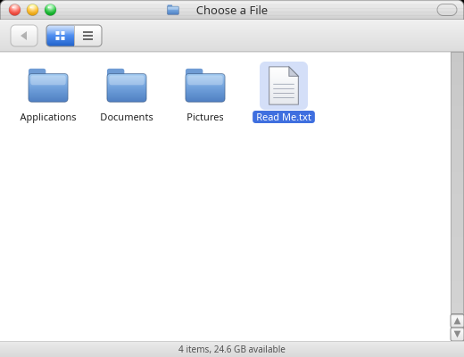

# Phase 7 — Portals: the capability desktop (scope)

The phase carved out of Phase 3 (PHASE3.md §6.1), expanded from a sketch into
executable detail, grounded in a read of the sibling's `reef-portal`, `reef-open`
and `reef-notify`. Read [PLAN.md](PLAN.md) for the locked decisions and
[PHASE3.md](PHASE3.md) for the substrate this builds on.

Last updated: 2026-07-30.

**Numbered 7, being done out of order.** PLAN.md's phases run 0–6 and this one is
new; it is being built now, before Phase 4 (Mac Pro) and Phase 6 (the Swift
compositor), because **it depends on nothing either of them provides**. The
numbering keeps existing references stable rather than renumbering four phases
for the sake of chronology.

**A correction that made this phase possible now.** PHASE3.md §6.1 carved this
out partly on the grounds that "the sibling's portal design is *compositor-owned*
(`reef-portal` lives in `tide`)". **That was wrong.** `reef-portal` is a shell
service under `de/reef/portal`, bound to `current`, that launches the file
manager as the picker — no compositor involved. Only screenshot wants compositor
privilege, and even that is reachable from a client through `wlr-screencopy`,
which is how `grim` has been taking every screenshot in this repo since Phase 1.
The dependency was on **`CurrentIPC`**, which P3.5 delivered.

---

## 1. What this phase is

**The brokerless answer to xdg-desktop-portal**, and PLAN.md's goal #3 made real:

> An app asks the desktop to pick a file. The portal runs the **Finder** as the
> picker, **opens the chosen file itself**, and returns the *open descriptor*
> over `SCM_RIGHTS`. The app reads a file it could never have opened — the demo
> client calls `cap_enter(2)` first and has no filesystem at all.
> **The descriptor is the capability.** No D-Bus, no broker, no flatpak.

That last sentence is the whole phase. Everything else is in service of being
able to demonstrate it end to end.

**Explicitly NOT in Phase 7** (decided 2026-07-30 with the user):

- **No D-Bus bridge, and no `org.freedesktop.portal.*`.** Stock GTK/Qt apps
  therefore do *not* get a working file chooser from us in this phase. That is a
  real gap and it is deliberate: D-Bus is a wire protocol we would have to speak
  from Swift (or back stock `xdg-desktop-portal` with our own backend), it
  roughly doubles the phase, and none of it advances the capability story that
  makes this design worth having. The guest already carries `dbus-1.16.2` and
  `gtk3` for whenever we do.
- **No XWayland, MPRIS or AT-SPI.** Same reasoning, further out.
- **No jail plumbing.** The sandboxed client proves the *capability* half with
  Capsicum; running an app in a real jail with the portal socket bind-mounted in
  is FreeBSD systems work that belongs with Phase 4's hardware/jail story.
- **No compositor.** As everywhere else, we run on stock sway/labwc.

---

## 2. What we already have vs. what's new

The substrate is done, which is why this phase is mostly *assembly*:

| Need | Have | New in Phase 7 |
|---|---|---|
| Typed IPC + **fd passing** | `CurrentIPC` (P3.5) — `SCM_RIGHTS`, `Server`, `call` | — |
| A file picker | the **Finder** (P2.6/P2.6b/P2.6c) | a **picker mode**: choose one file, report it, exit |
| A service host | `Current.Server`, run-loop hook (§2.18) | the `portal` service itself |
| Notifications | — | an **Aqua toast** (layer-shell OVERLAY) + `notify` |
| Screenshot | `grim` in the harness | **`wlr-screencopy`** bound in `Surface` |
| Sandboxing | — | **Capsicum** `cap_enter(2)` in the demo client |

---

## 3. Component map (sibling → ours)

| Job | Sibling | Ours | Notes |
|---|---|---|---|
| The portal service | `reef-portal` (234 LOC) | `Portal` + `abyss-portal` | `file.open`, `file.save`, `notify`, `screenshot` |
| The sandboxed client | `reef-open` (90 LOC) | `abyssopen` | `cap_enter`, then read through the returned fd |
| Notify CLI | `reef-notify` (110 LOC) | `abyssnotify` | the `notify-send` analog |
| The picker | `reef-fm` | our **Finder** | needs the picker seam (P7.1) |
| The toast | `reef-panel`'s toast | **new Aqua UI** | the sibling's panel is GNOME-2 dress; ours is Jaguar |

Small components — ~430 LOC of Rust total — because the hard part (fd-passing
IPC) is already built and the picker is a program we already have.

---

## 4. Ordered passes

**P7.1 — The Finder as a picker. ✅ done.**
`$ABYSS_FINDER_PICK=<result-path>` turns the Finder into a portal's picker:

The contract is deliberately file-shaped, as the sibling's was — a private
result file plus an exit code — which keeps the picker a **separate process**
with no API surface the requesting app can reach. That is what lets the picker
be the file manager we already have rather than a library the portal links in
(§6.1).

- **choose** → the path is written to the result file, exit **0**
- **cancel** (Escape, or closing the window) → nothing written, exit **1**
- **anything else** → a crash, which the portal can therefore tell apart (§6.2)

**A file dialog must never launch what you click.** `finderActivation` is a pure
rule shared by every activation path: a folder navigates in both modes, but a
file *launches* normally and is *chosen* in picker mode. The case most likely to
go wrong — double-clicking an `.app` bundle in a picker — is a test of its own,
because a picker that runs the thing you selected would both surprise the user
and let the requesting app make the picker execute code on its behalf.

`readResult` refuses anything that isn't an **absolute path**: the portal opens
whatever comes back, so a relative path would resolve against the *portal's*
working directory instead of the user's choice.

*Verified:* 5 unit tests (110 total) for the activation rule and the result
contract — including that an empty result file (a picker that died mid-write) is
not a choice — plus two live modes on both platforms. `live-sway.sh --pick`
double-clicks a seeded file and asserts on **disk and in the process table**:
the right path was written, the picker *exited*, it exited **0**, and nothing
was launched. `--cancel` drives Escape from the keyboard and asserts exit **1**
with no result written.

*Two bugs in the test itself, both worth the scar tissue:* `--cancel` initially
reused the choose path's double-click, so it chose the file before the keyboard
ever got a turn; and `wait "$app_pid"` under `set -e` **aborted the script** the
moment a cancelled picker exited 1, before `$?` could be read — the failure
looked like the test silently stopping. `rc=0; wait ... || rc=$?` is the form
that works.

**P7.2 — The portal service: `file.open` and `file.save`. ✅ done.**
`abyss-portal` binds the `portal` service and answers `file.open {dir?}` and
`file.save {dir?, name?}` — running the picker, **opening the chosen path
itself**, and returning the descriptor as `file`. Declining replies
`{ok:false, error:"cancelled"}`.

**The confused-deputy rule is enforced by the type, not by a check.**
`PortalRequest` has *no case and no field* that can carry "the file to open" —
an app supplies a suggested directory and nothing else. The bug portals exist to
prevent is made **unrepresentable** rather than guarded against, and the test
that pins it throws `path` and `file` at a request and asserts only the
directory survives. The hints are sanitised too: a start directory must be
absolute (a relative one would resolve against the *portal's* cwd), and a
suggested name must be a single path component (an app proposing
`../../.ssh/authorized_keys` is proposing a location, not a name).

**Cancel, crash and choice are read from two signals together** (§6.2): the exit
status *and* the result file. Exit 0 with nothing written is a broken picker,
reported as failure — never as a choice, which would have the portal opening
whatever a stale result file held.

*A gap closed on the way:* `file.save` needs to name a file that doesn't exist
yet, which picking from a listing cannot express — so in save mode **⌘S saves
into the folder on screen** under the suggested name. That is a stopgap with a
real Aqua save panel (name field, New Folder) behind it, and it is called out
here rather than left to be discovered. Without it `file.save` could only ever
overwrite something that already existed.

*Also new:* `ap_run_and_wait` in `CProc`, deliberately separate from the
supervision API — `ap_child_spawn` hands back a *pollable descriptor* and cannot
report an exit status on FreeBSD, where pdfork's status arrives only through a
kqueue `NOTE_EXIT` a poll() loop never collects. A caller that runs one child and
waits for the answer wants plain fork/waitpid, and now has it.

*Verified:* **11 unit tests** (121 total) on both platforms, most of them about
what the portal *refuses*. Live, **`abyss/tests/live-portal.sh`** runs the whole
story with three real processes — `abyss-portal`, the Finder as picker driven by
a virtual pointer under headless sway, and `ipcprobe` as the requesting app — and
asserts all three halves of the claim: the client read the contents **through the
descriptor**, it was **the file the user chose**, and the client **only ever sent
a directory**. Green on Linux and FreeBSD.

**P7.3 — The sandboxed client (the headline).**
`abyssopen` calls **`cap_enter(2)`** — irreversibly dropping into Capsicum
capability mode, with no `open`-by-path and no global namespace — and *then*
asks the portal for a file. It reads the contents through the returned
descriptor and writes them to stdout (an already-open fd; a sandboxed process
cannot create a new one either).
Capsicum is FreeBSD-only, so this claim is **verifiable only in the VM**; on
Linux the same binary runs unsandboxed and says so rather than implying a
sandbox it doesn't have.
*Verify:* in the guest, `abyssopen` prints a file's contents **after** entering
capability mode, and a control run proves `open(2)` on the same path fails from
inside the sandbox — the second half is what makes the first half mean anything.

**P7.4 — Notifications: an Aqua toast, and `notify`.**
A notification window in Jaguar dress on a layer-shell **OVERLAY** surface, with
`keyboard_interactivity: none` so it never steals focus, stacking for multiple
notifications, a timeout, and click-to-dismiss. Then the portal's
`notify {summary, body?, timeout?}` relays to it, and `abyssnotify` is the CLI.
A jailed app reaches the toast **only** through the portal — it never holds the
shell's control socket, which is the same trust boundary the file chooser draws.
*Verify:* pure layout tests (stacking, wrapping, timeout arithmetic); live, a
toast appears on the desktop and disappears on its own, captured with grim.

**P7.5 — Screenshot, as a capability.**
Vendor `wlr-screencopy-unstable-v1`, bind it in `Surface` (the mechanical recipe
— HANDOFF §7 — `xdg-activation` is the worked example), and add
`screenshot {}` → a fd holding the PNG. Same shape as the file chooser: the app
receives **a descriptor, not a path**, and never gets to name what it captures.
*Verify:* live, a client with no filesystem access receives a screenshot fd whose
bytes are a valid PNG of the right dimensions.

---

## 5. Verification

Unchanged discipline: pure logic in unit tests, the real thing live under
headless sway, everything green on **both** platforms — except the Capsicum
half, which is FreeBSD-only by nature and must say so rather than being quietly
skipped. `abyss/tests/run.sh --vm --live` remains the gate.

---

## 6. Risks / open decisions

**6.1 The picker is a whole file manager, and it must not become a library.**
Keeping it a separate process (result file, exit code) is what makes this cheap;
the temptation will be to link the Finder into the portal for a "nicer" API and
lose the isolation that makes the design safe.

**6.2 Cancel must be unambiguous.** "The user cancelled" and "the picker
crashed" have to be distinguishable, or a crashed picker silently looks like a
declined request. Exit code *and* result-file state, checked together.

**6.3 The portal is a trusted process.** It runs as the user with full
filesystem access, on purpose. Its whole security value is that it opens only
what the *user* picked — §6.1's confused-deputy rule is the invariant to test,
not just document.

**6.4 Capsicum limits what the demo can do.** After `cap_enter` there is no
`open`, no `socket`... **including the portal socket itself** — so the client
must connect *before* entering capability mode and keep the connection as its
only capability. Getting that order wrong makes the demo fail in a way that
looks like the portal is broken.

**6.5 The toast is net-new Aqua UI.** Jaguar's notification style is not in the
512pixels library the way windows and menus are (Growl-era third-party
conventions muddy it), so this is a *design* decision as much as an
implementation one — expect to iterate on it rather than copy a reference.

**6.6 Screenshot on someone else's compositor.** `wlr-screencopy` is a wlroots
protocol; a Swift compositor (Phase 6) will have to implement it, or the
screenshot portal will need a compositor-owned path then. Worth knowing now, not
worth solving now.

**6.7 The D-Bus gap is real.** Until the carved-out bridge exists, a stock GTK
or Qt app gets no file chooser from us. Anyone reading "portals: done" should
read it as "*our* portals, for *our* apps, done".
