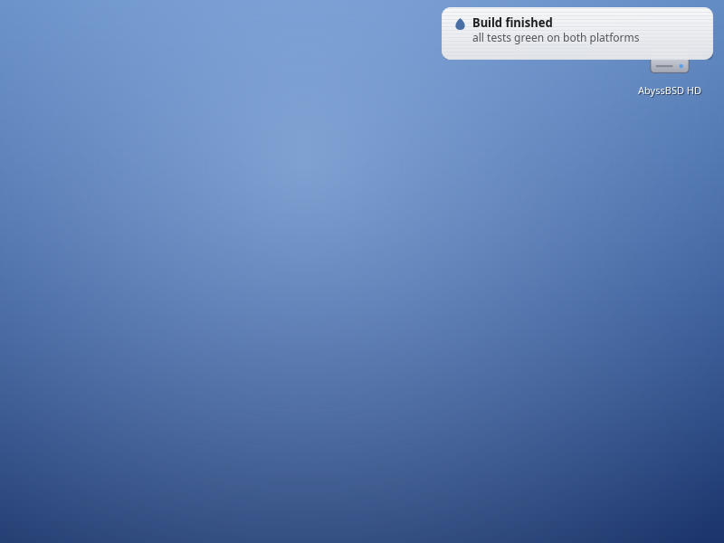
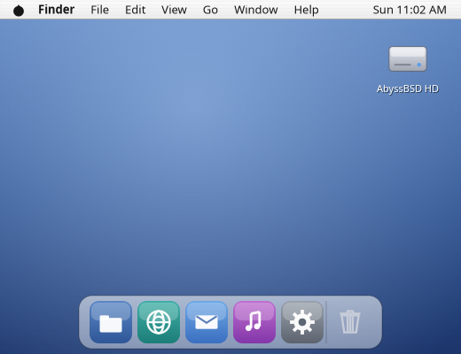
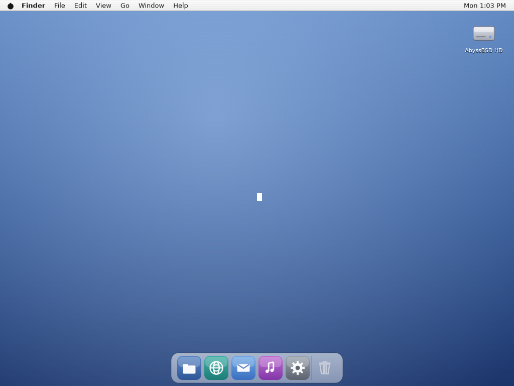
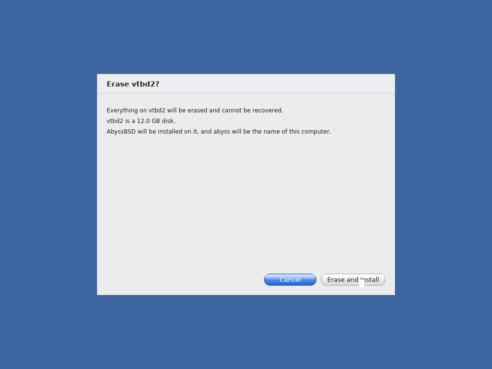
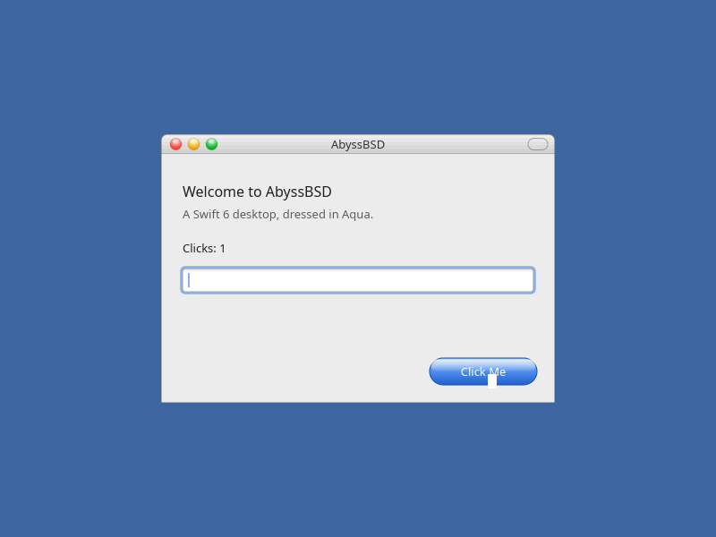
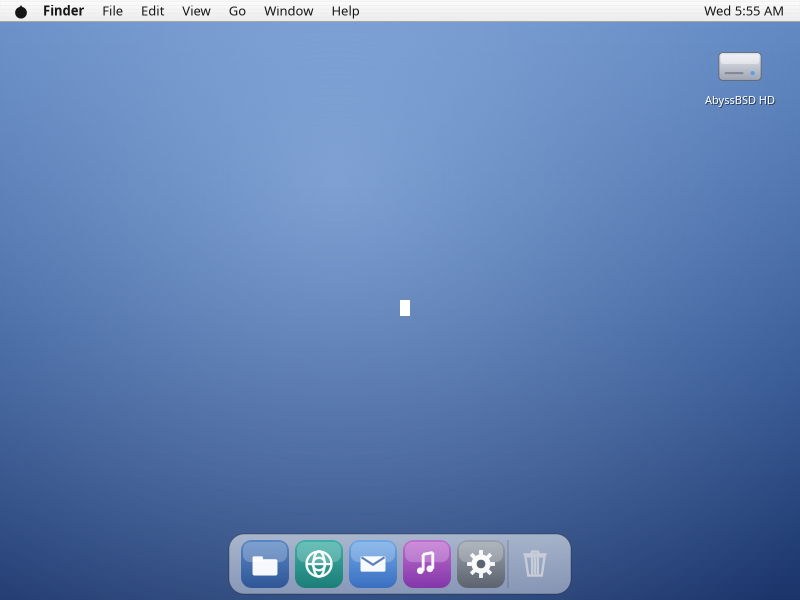

# AbyssBSD (Swift DE) — Status & Handoff

The resume-from-here doc. For the *why* and the full roadmap see [PLAN.md](PLAN.md);
for lessons learned + interop traps see [HANDOFF.md](HANDOFF.md).

Last updated: 2026-08-24. **Phases 0–3 and 5–8 are complete.** The Jaguar desktop
runs on our own compositor, which holds its frame contract under eleven hostile
processes; the portals hand out descriptors; and **one command boots a desktop
where an unmodified GTK 3 application opens a file through the Finder** — which
is the claim the D-Bus phase existed to make.
**315 unit tests + 39 live modes, green on Linux *and* FreeBSD.**
**Phase 5 — the installer — is COMPLETE** ([PHASE5.md](PHASE5.md), P5.1–P5.5):
**a machine with an empty disk boots our medium, the Aqua installer comes up on
it, and it reboots into the Jaguar desktop as the account that was created** —
on every run of the harness, nested twice over, with no hardware and no human.
**Phase 4 (Mac Pro) is the only phase left; it is scoped, and P4.1 and P4.3 are
done — there is an image to write to a stick and boot**
([PHASE4.md](PHASE4.md)); see [What's next](#whats-next).

## What this is

A FreeBSD fork whose desktop environment is written in **Swift 6**, styled as a
faithful **Mac OS X 10.2 "Jaguar" Aqua** clone, on **Wayland**. Sibling project
`../AbyssBSD` (Rust DE) is the **design source we rewrite from** — its compositor
(`tide`), IPC (`current`), config (`pool`) and helpers are reference
implementations to read, not code to link. **The product is Swift**, dropping to
C only where Swift can't reach (system-library shims like `de/cwayland`).
`PoolConfig` is the pattern: a Swift rewrite of the Rust `pool` that shares the
on-disk format and none of the code. See PLAN.md for the locked-in decisions
(faithful clone; Linux-first dev; full phased roadmap).

**Phase 2 built the shell** (all of it now shipped; the tour below is the
record of how, pass by pass). P2.1 added the `wlr-layer-shell` surface role to `Surface`
and a BACKGROUND **wallpaper** (`AQUA_SCENE=wallpaper`) — the shell's foundational
surface type, verified live under sway. P2.3 added **`PoolConfig`**
(`de/poolconfig/`), the Swift port of the Rust `pool`: read/write/watch the same
`~/.config/abyss/*.ini` files (mmap read, atomic-rename write, inotify/kqueue
directory watch) so Swift and Rust components stay config-compatible. P2.2 made
the wallpaper the real **Desktop**: it reads `desktop.ini` (image / gradient /
flat `bg` / built-in Jaguar blue) and **hot-reloads** when the file changes — the
watcher fd is folded into the run loop via `Display.addFileDescriptor`. Verified
live: a config gradient, then an atomic edit repaints the desktop flat. P2.4
added the **menu bar** (`AQUA_SCENE=menubar`): a layer-shell TOP strip with an
exclusive zone, the system menu (an original water-drop glyph), the bold app menu,
File/Edit/View/…, and a live clock — clicking a title opens a real Aqua dropdown
(a grabbing popup **parented to the layer surface**), verified live
(). P2.5 added the **Dock**
(`AQUA_SCENE=dock`): a layer-shell BOTTOM shelf that **magnifies** under the
pointer, with running-app indicators driven by **`wlr-foreign-toplevel-management`**
(`Surface.ForeignToplevels`) and the Trash — clicking a running tile activates its
window (). P2.6 added the **Finder**
(`AQUA_SCENE=finder`) — the first shell piece that is an ordinary xdg-shell
*application* rather than a layer surface: real `readdir` listings in an Aqua
icon grid or list view, browsing in place with a toolbar Back button, a
scrollbar, and full keyboard navigation
(). P2.7 gave the desktop its **icons**
(the boot volume + `~/Desktop`, arranged top-right-down as in Jaguar), where a
double-click opens a real Finder window
(). The Finder's second pass
added **spatial mode**: hide the toolbar with the title bar's pill and every folder gets its own
window, with **xdg-activation** raising one that's already open
() — which made the client
runtime multi-window (`Display` routes input **by wl_surface**). P2.10 tied it
together: **`abyss/session.sh`** boots the whole shell with one command — a
nested (or headless, or already-running) compositor plus the desktop, menu bar
and Dock, supervised and torn down together
(). P2.11 tied off the shell's loose
ends: the Dock's **Trash** fills, opens and **empties** (right-click → Empty
Trash, the only code here that unlinks —
), the **menu bar is fully
keyboard-drivable** (click a title, then Left/Right/Up/Down/Return/Escape), and
an **`.app` bundle is drawn with its own icon** from `Contents/Resources`
(PNG, including PNGs embedded in an `.icns`). See
[PHASE2.md](PHASE2.md) for the ordered scope.

## It runs on FreeBSD (Phase 3 — complete)

The point of the whole exercise, on the target OS — a Swift 6 desktop under
stock sway in the FreeBSD 15 build VM, captured with grim:

And the toolkit alone, headless with no compositor at all:


The whole **harness** passes there too — **197 unit tests and all 35 live modes**,
including pointer/keyboard injection, file operations checked on disk, and the
desktop, menu bar and Dock brought up as one session. That session is now run by
**`anchor`**, the Swift supervisor, rather than by a shell script — and the menu
bar carries real status items fed by the Swift hardware bridges:


## Current state — the Aqua shell runs (Phase 1 toolkit + Phase 2 shell)

A Swift 6 package builds on Linux and renders a faithful Jaguar window
( — glossy traffic lights,
gradient title bar, pinstriped content, a lickable blue gel button, HiDPI-crisp).

- **Swift 6.3.1** is installed on this Linux box; all client-side C libs are
  present (wayland-client, xkbcommon, cairo, freetype2, harfbuzz, libpng).
  `sway` (1.11) and `grim` are installed for live testing; `labwc` and `libjpeg`
  are not.
- Build: `swift build`. Tests: `swift test` (197 green — Aqua toolkit + desktop
  config + menu-bar layout + Dock magnification + the Finder's listing/geometry
  model + file ops, emptying the Trash, bundle-icon lookup and `.icns`
  extraction, self-executable resolution, PoolConfig read/write/watch, and the
  CurrentIPC codec + descriptor passing, the supervisor's restart policy, the
  hardware bridges' parsing, the portal's refusals, and the screencopy pixel
  normalisation).
  **The same 197 pass on FreeBSD** in the build VM (`abyss/vm/build.sh`).
- The package layout (`Package.swift`, targets under `de/`):
  - `CWayland` — C interop: libwayland-client + generated **xdg-shell** + a
    shm-fd helper + a shim exporting libwayland's static-inline requests so
    Swift can call them (`de/cwayland/`). Regenerate protocols with
    `de/cwayland/generate-protocols.sh`.
  - `CCairo` — system cairo (pkgConfig), the Phase-1 software 2D backend;
    now also exposes cairo-ft for real text.
  - `CText` — real text: FreeType face management (regular + bold/italic/
    bold-italic) + HarfBuzz shaping behind a small C API (`de/ctext`), with
    `CFreeType`/`CHarfBuzz` systemLibraries supplying the pkg-config flags. Aqua
    paints the shaped run via cairo-ft, caching runs and shaping at device px.
  - `Surface` — Wayland client runtime: `Display` (connection, registry,
    globals, a poll-timeout dispatch loop with **key repeat**, per-surface
    pointer routing incl. **scroll-wheel**, `wl_output` scale tracking) + `Window`
    (xdg-shell toplevel, 2× shm buffers, frame-callback pacing, pointer input,
    per-output buffer scale) + **`LayerSurface`** (a `wlr-layer-shell` role for
    shell components — layer/anchors/exclusive-zone, its own configure/ack,
    reusing the buffer/frame/scale machinery) + `Popup` (a
    grabbing xdg-popup child surface for menus) + `Keyboard` (`wl_keyboard` +
    xkbcommon keycode→keysym/UTF-8 **plus the modifier state**, via the `CXkb`
    system module) +
    `WindowDelegate`/`LayerSurfaceDelegate`/`PopupDelegate`/`PixelBuffer`. Input
    routes to the window *or* the layer surface (one per process). Also
    `ForeignToplevels` (tracks running apps via
    `wlr-foreign-toplevel-management`, for the Dock), **xdg-activation**
    (`Display.activate(surface:)` — how a client raises its own window),
    **`Screencopy`** (`wlr-screencopy`: the compositor copies an output into a
    buffer we supply, normalised to cairo's layout — the compositor dictates
    stride, format and row order, so all three are handled rather than assumed),
    and an
    `addFileDescriptor` hook to fold config-watch / timer fds into the run loop.
    `Display` holds a weak **window registry** and routes pointer/keyboard by the
    `wl_surface` the `enter` events name, so one process can run many windows
    (the spatial Finder).
  - `Aqua` — the toolkit: `Theme` (10.2 tokens), `Draw` (cairo gel buttons,
    traffic lights, gradients, pinstripe, text, and the control set: checkbox,
    radio, slider, pop-up button, progress bar, text field, group box,
    scrollbar, segmented control, tab view, modal sheet), `Text`
    (FreeType/HarfBuzz shaping via `CText`, painted through cairo-ft — with a
    cairo toy-text fallback when no font is found), `Scene`/`Widgets` (the window
    painters), `AquaWindow` (a live window wiring pointer/keyboard to the
    controls).
  - `PoolConfig` — config: read/write/watch the same `~/.config/abyss/*.ini`
    files as the Rust `pool` (mmap read, atomic-rename write, directory watch via
    the `CPoolWatch` inotify/kqueue shim). Pure syscalls, no Wayland — the shell
    components and tests use it independently (`de/poolconfig/`).
  - `CPlatform` — platform facts Swift can't reach: `ap_self_executable`
    (`/proc/self/exe` on Linux, the `KERN_PROC_PATHNAME` sysctl on FreeBSD,
    whose Swift libc module surfaces no `<sys/sysctl.h>`) and **SCM_RIGHTS fd
    passing**, since `cmsg(3)` is entirely macros.
  - `Vents` + `CVents` — the FreeBSD hardware bridges: **sysctl** (Swift's libc
    module surfaces no `<sys/sysctl.h>`, so it goes through C), the **OSS mixer**
    (`ioctl` is variadic, likewise C), the **battery** off `hw.acpi.battery.*`,
    and a **devd** reader whose fd folds into the run loop for hotplug. Every
    accessor returns nil when the facility is absent, which is what lets the
    menu bar hide a status item instead of inventing a reading. `ventsctl` reads
    them by hand.
  - `Anchor` + `anchor` — the session supervisor (`de/anchor`, `de/anchorbin`):
    starts the compositor and the shell, restarts a component that dies, and
    tears the session down as a unit. Every child is a **pollable descriptor**
    (`pdfork` on FreeBSD, `pidfd` on Linux — `de/cproc`), so it is one `poll()`
    loop carrying children, the control socket and a signal self-pipe. Drive it
    with **`abyssctl status|quit`**.
  - `CurrentIPC` — the brokerless control plane (`de/currentipc`): a typed `Msg`
    (string / u64 / bool / bytes / **fd**) with its own compact wire format, a
    `Server` on `<runtime_dir>/<service>.sock`, `connect` and one-shot `call`.
    Descriptors travel over `SCM_RIGHTS`, so a message can hand over an shm or
    dmabuf handle with no pixel copies. No Wayland, no Aqua, no platform fork —
    a Swift rewrite of the sibling's `current` that shares none of its code and,
    deliberately, not its nvlist wire format either.
  - `AquaDemo` — the runnable demo.

A **System Preferences** demo scene reproduces the Jaguar layout (toolbar with
Show All + favorites, the four category sections in order, separators, a 7-column
labeled icon grid with original procedural Aqua icons — `de/aqua/Icons.swift`):


An **Aqua Controls** scene (`AQUA_SCENE=widgets`) shows the classic control set —
checkboxes, radio group, slider, pop-up button, a candy-striped progress bar and
OK/Cancel gel buttons — all interactive (`de/aqua/Widgets.swift` + `Draw`
primitives): 

It also has full **keyboard focus/traversal**: Tab / Shift-Tab move a soft blue
focus ring through the controls (starting on the default OK button), Space
activates the focused control (toggling a checkbox or opening the pop-up menu),
the arrow keys nudge the focused slider or radio group, and Return / Escape fire
the default (OK) / Cancel buttons. Pop-up menus and the modal sheet take the
keyboard too (menu: arrow-keys + Return/Escape during its grab; sheet:
Return/Escape as default/cancel). Here Tab has walked focus to the slider (its
ring shows) after Space unchecked the first box and the arrows drove the level up:


A **Scroll** scene (`AQUA_SCENE=scroll`) shows a striped list in a clipped
viewport with a working Aqua scrollbar — blue gel gumdrop thumb, paired arrows at
the bottom (Jaguar's default) — driven by thumb-drag, arrow/track clicks, and the
arrow/page/Home/End keys (`de/aqua/Scroll.swift`):


A **Tab View** scene (`AQUA_SCENE=tabs`) shows the two joined-button controls: a
segmented control (a view switcher) and a tab view whose selected tab merges into
a content pane that changes with the selection — click or arrow-key to switch
(`de/aqua/Tabs.swift`): 

A **Sheet** scene (`AQUA_SCENE=sheet`) shows an Aqua modal sheet that slides down
from the title bar (animated), dims and blocks the parent, and dismisses via its
Cancel/Delete buttons — recording the choice below (`de/aqua/Sheet.swift`):


The **Finder** (`AQUA_SCENE=finder`) is the first real *application*: a Jaguar
browser window over the live filesystem — a toolbar with Back and an icon/list
view switch, a white item well with original procedural folder / document /
application / volume icons, an Aqua scrollbar, and the "12 items, 39.6 GB
available" status bar (`de/aqua/Finder.swift` + the pure `FinderModel.swift`):
 

Click selects, double-click browses into a folder *in place* (the 10.2 Finder is
a browser by default — and it is standard Aqua, since brushed metal is a 10.3
texture), Back returns and re-selects the folder you came out of. Clicking the
title bar's **pill** hides the toolbar and switches to **spatial mode**, where
each folder opens in its own window, re-opening an open folder raises it (via
xdg-activation) instead of duplicating it, and the red light closes one window —
the app quits with the last. The mode persists to `finder.ini`.

(A Wayland client can't position its own windows, so the "remembered position"
part of spatial Finder waits for a compositor of our own; size/view/mode persist.)

Double-clicking something that isn't a folder **launches** it: an `.app` bundle
runs `Contents/MacOS/<name>`, an executable runs directly, and anything else goes
to the opener command (`$ABYSS_OPEN`, else `open_command` in `finder.ini`) — with
an honest "no handler" when nothing is set. The desktop icons and the **Dock**
share that path, so a Dock tile whose app isn't running launches it (another copy
of this binary in the right scene) instead of just logging.

It also **operates on files**, with the Mac's verbs rather than a PC file
manager's: **Return** renames in place (⌘O, ⌘↓ or a double-click open), **⌘⇧N**
makes a new folder and opens its name for editing with the base pre-selected,
**⌘D** duplicates, **⌘C/⌘X/⌘V** copy/cut/paste through a clipboard shared across
windows, and **⌘⌫** moves to `~/.Trash` — nothing here unlinks what you asked to
delete. Naming follows the Finder ("untitled folder 2", "Read Me copy.txt"), and
every window showing an affected folder re-reads. Here a new folder has been
created and renamed to "Reports", and Return has opened a rename on "Read Me.txt"
with just the base name selected:

The keyboard drives it all: arrows (a whole row at a time in icon view), Home /
End, Return to open, Backspace to go up, Page keys to scroll, Tab to switch view,
and type-ahead selection. It reads `finder.ini` (`view`, `show_hidden`) and starts
in `$ABYSS_FINDER_DIR` (else `$HOME`).

The window also **tracks its output's scale** (`wl_output` + `wl_surface`
enter/leave): drop it on a HiDPI (scale-2) output and it re-cuts its buffers and
repaints crisp at 2× with no `AQUA_SCALE` — that env var is now just an optional
pin. Verified live at a scale-2 headless output (`live-sway.sh widgets --hidpi`,
a 920×720 capture of the 460×360 window):


It also runs **live** now: `abyss/tests/live-sway.sh` brings the window up under
a headless sway and captures it with grim — a true test of the xdg-shell /
shm / frame-callback path the PNG render skips
(). With `--click` it drives a real
pointer click through a wlr-virtual-pointer and the counter increments
(). With `--type` it drives
real keystrokes through a virtual keyboard into the window's text field
() — the full `wl_keyboard` + xkbcommon
path. On the widgets scene, `--click` toggles a checkbox and moves the slider —
real pointer-driven control interaction
(). On the scroll scene it drags
the scrollbar thumb and the list scrolls to the bottom
(). With `--menu` it opens a **real
pop-up menu** — a grabbing xdg-popup child surface — under the Appearance button,
with hover-highlight and the current item checkmarked
(); choosing an item sets the value and
dismisses. On the tabs scene it clicks the "Columns" segment and the "Sharing"
tab (). On the sheet scene it clicks
"Delete…" and the modal sheet slides out over the dimmed window
(). With `--wheel` it spins the scroll
wheel (`wl_pointer.axis`) and the list scrolls to the bottom without touching the
thumb (); with `--repeat` it holds one
key and the field fills with repeats — real **key repeat** off the compositor's
`repeat_info`, driven by a poll-timeout event loop
().

## Portals — the capability desktop (Phase 7, complete)

The brokerless answer to xdg-desktop-portal. An app asks the desktop for
something; the desktop does it and hands back **an open descriptor**. No D-Bus,
no broker, no flatpak — `abyss-portal` is a `CurrentIPC` service, and descriptors
ride over `SCM_RIGHTS`.

- **`file.open` / `file.save`** run the **Finder as the picker** and the portal
  opens what the user chose. A request has **no field for the file to open** —
  the confused-deputy bug is unrepresentable rather than guarded against.
- **`notify`** relays to the shell's toast, so a jailed app never holds the
  notification service's socket. 
- **`screenshot`** captures via `wlr-screencopy` (in a separate `abyssgrab`
  process, so the portal is never a Wayland client) and returns the PNG as a
  descriptor. It **names nothing**: no request field, no `path` in the reply, and
  the image is unlinked the moment it is opened — so after the reply, the
  descriptor is the only route to those bytes that exists for anyone. Here is one
  taken through the portal by a client that has no filesystem:
  

**And the claim is checked, not asserted.** `abyssopen` enters Capsicum
capability mode *before* asking, so it has no filesystem and cannot name any
address. It then reads a file whose path it demonstrably cannot `open(2)`, and
holds a picture of a screen it demonstrably cannot `connect(2)` to. Capsicum is
FreeBSD-only, so on Linux the same binary says plainly that it is **not**
sandboxed rather than implying a confinement it doesn't have.

## How to run

```sh
swift build && swift test

# The compositor's frame contract. The first two need no compositor, GPU or
# display at all; the third runs undertow on a real wlroots headless backend.
abyss/tests/bench-metronome.sh
.build/debug/undertow bench-metronome --hz 240 --frames 600 --surfaces 512
.build/debug/undertow bench-alloc     --frames 5000 --surfaces 512
.build/debug/undertow headless --hz 60 --frames 120 --width 800 --height 600

# undertow as a real compositor, with a real client on it (starts no sway):
abyss/tests/live-undertow.sh /tmp/frame.ppm          # a real client on it
abyss/tests/live-undertow-input.sh                   # a click reaching that client
abyss/tests/live-undertow-c2.sh                      # C2: eleven hostile processes
abyss/tests/live-undertow-shell.sh /tmp/shell.ppm    # the Aqua shell composing
abyss/tests/live-undertow-places.sh                  # a window reopens where it was left
.build/debug/undertow run --hz 60 --frames 400 --width 800 --height 600 \
    --capture /tmp/frame.ppm      # then: WAYLAND_DISPLAY=<printed> AquaDemo

# The portals, end to end (each starts its own headless sway):
abyss/tests/live-portal.sh          # a client, a picker, a descriptor
abyss/tests/live-portal-dbus.sh     # ...and the same picker, over the session bus
abyss/tests/live-sandbox.sh         # ...with no filesystem at all
abyss/tests/live-screenshot.sh /tmp/shot.png    # ...and no way to reach the screen
abyss/tests/live-notify.sh          # a toast, via the portal

# Screenshots by hand — abyssgrab is a usable tool, like ventsctl/abyssctl:
.build/debug/abyssgrab /tmp/shot.png            # --output N, --cursor
.build/debug/abyssopen --screenshot > /tmp/portal-shot.png   # ...through the portal

# The whole desktop under the Swift supervisor (the replacement for session.sh):
.build/debug/anchor --display "$WAYLAND_DISPLAY"    # or --compositor CMD
.build/debug/abyssctl status                        # ... and abyssctl quit

# The control plane between two real processes (no compositor needed; also part
# of run.sh's default lane):
abyss/tests/live-ipc.sh
abyss/tests/live-anchor.sh    # supervision: restart a killed component, quit

# Every live mode in one go (pass/fail table; -o DIR keeps the PNGs + logs):
abyss/tests/run-live.sh
abyss/tests/run-live.sh -o /tmp/shots dock trash   # ... or just some of them

# The same, on FreeBSD: sync the tree into the build VM and run there.
# (Swift lives off PATH in the guest, so use the scripts rather than ssh by hand.)
abyss/vm/check.sh          # is the guest usable? packages, pkg-config, tools
abyss/tests/run.sh --vm    # build + unit tests + smoke render, in the VM
abyss/tests/run.sh --vm --live   # ... and all 35 live modes + the portals there
abyss/vm/build.sh          # quicker: just sync + swift build + swift test
abyss/vm/build.sh --no-test -- -c release

# The whole desktop, one command (nested inside your session by default):
abyss/session.sh                       # --headless / --attach; --without dock; Ctrl-C quits
abyss/tests/live-session.sh /tmp/session.png   # ... and the live test that asserts it composes

# Headless visual check — renders one frame to PNG, no compositor needed:
AQUA_RENDER_PNG=/tmp/aqua.png AQUA_SCALE=2 .build/debug/AquaDemo
AQUA_SCENE=sysprefs AQUA_RENDER_PNG=/tmp/prefs.png AQUA_SCALE=2 .build/debug/AquaDemo
AQUA_SCENE=widgets  AQUA_RENDER_PNG=/tmp/widgets.png AQUA_SCALE=2 .build/debug/AquaDemo

# Live, against a running Wayland compositor that offers xdg-shell
# (WAYLAND_DISPLAY must be set):
.build/debug/AquaDemo                       # AQUA_SCALE=2 forces 2x; AQUA_SCENE=sysprefs

# Live smoke test under a headless sway, captured with grim (no display needed):
abyss/tests/live-sway.sh sysprefs /tmp/live.png
abyss/tests/live-sway.sh --click /tmp/click.png          # drive a real pointer click
abyss/tests/live-sway.sh --type  /tmp/type.png           # drive real keystrokes
abyss/tests/live-sway.sh widgets /tmp/widgets.png --click # toggle a checkbox + move the slider
abyss/tests/live-sway.sh scroll  /tmp/scroll.png  --click # drag the scrollbar thumb
abyss/tests/live-sway.sh --menu  /tmp/menu.png            # open a real xdg-popup menu
abyss/tests/live-sway.sh tabs    /tmp/tabs.png    --click # switch a segment + a tab
abyss/tests/live-sway.sh sheet   /tmp/sheet.png   --click # open a modal sheet
abyss/tests/live-sway.sh widgets /tmp/keys.png    --keys  # Tab/Space/arrows drive focus
abyss/tests/live-sway.sh --menu  /tmp/mkeys.png   --keys  # arrow-key the pop-up menu
abyss/tests/live-sway.sh widgets /tmp/hidpi.png   --hidpi # scale-2 output → auto 2x
abyss/tests/live-sway.sh scroll  /tmp/wheel.png   --wheel # scroll-wheel the list
abyss/tests/live-sway.sh window  /tmp/rep.png     --repeat # hold a key → it repeats
abyss/tests/live-sway.sh wallpaper /tmp/wall.png         # a layer-shell BACKGROUND wallpaper
abyss/tests/live-sway.sh --reload  /tmp/wall.png         # desktop.ini config + hot-reload
abyss/tests/live-sway.sh --menubar /tmp/mbar.png         # menu bar (TOP) + open a dropdown
abyss/tests/live-sway.sh --dock    /tmp/dock.png         # Dock (BOTTOM) magnify + foreign-toplevel
abyss/tests/live-sway.sh --finder  /tmp/finder.png       # browse a seeded dir: open, Back, list view
abyss/tests/live-sway.sh --finder --keys /tmp/fkeys.png  # ... and drive it from the keyboard
abyss/tests/live-sway.sh --spatial /tmp/spatial.png      # spatial: 2 windows, raise, close one
abyss/tests/live-sway.sh --fileops /tmp/fileops.png      # new folder/rename/copy/trash, checked on disk
abyss/tests/live-sway.sh --desktop /tmp/desk.png         # desktop icons: select, open a Finder window
abyss/tests/live-sway.sh --launch  /tmp/launch.png       # double-click an .app bundle / a document
abyss/tests/live-sway.sh --trash   /tmp/trash.png        # Dock Trash: right-click -> Empty Trash
abyss/tests/live-sway.sh --menubar --keys /tmp/mbk.png   # drive the menu bar from the keyboard alone

# Finder (an ordinary xdg-shell app) over a real directory:
ABYSS_FINDER_DIR=~/Documents AQUA_SCENE=finder .build/debug/AquaDemo

# Wallpaper (layer-shell) PNG preview, no compositor:
AQUA_SCENE=wallpaper AQUA_RENDER_PNG=/tmp/wall.png .build/debug/AquaDemo
# Config-driven live: point AquaDemo at a config dir with a desktop.ini
ABYSS_CONFIG_DIR=~/.config/abyss AQUA_SCENE=wallpaper .build/debug/AquaDemo
```

## Conventions (inherited from the sibling, adapted to Swift)

- **Minimal third-party deps.** New capability = hand FFI to a mature C system
  library (or vendored C), not a SwiftPM registry dep. See `CWayland`/`CCairo`.
- **Wrap in phase 1, rewrite in Swift later.** e.g. cairo now; a Swift/GPU
  renderer later.
- **The static-inline trap:** every `wl_*` request and `*_add_listener` is
  `static inline` and invisible to Swift — add a one-line `aw_*` wrapper in
  `de/cwayland/cwayland_shim.c` (and a decl in `cwayland.h`) and call that.
- **Listener lifetime:** libwayland keeps the listener pointer; `Display`
  heap-allocates each listener struct and frees them in `deinit`. Pass the owner
  via `Unmanaged.passUnretained(...).toOpaque()` as the `data` arg.

## What's next

**Phases 0–3 and 6–8 are complete.** The choice recorded here on 2026-08-23 —
Phase 4 or Phase 5 — was made: **Phase 5, the installer, is scoped**
([PHASE5.md](PHASE5.md)).

> **Phase 4 is scoped; P4.1 and P4.3 are done — there is a stick to boot**
> ([PHASE4.md](PHASE4.md)). `undertow` chooses its backend, and the medium now
> carries **45 kernel modules** (the drm stack and Southern Islands firmware),
> `seatd`, and a `loader.conf` that asks `amdgpu` for `si_support`. The live
> session picks its backend from what the machine has — `/dev/dri` present means
> a display, absent means headless — so the harness is untouched and a Mac Pro
> gets asked for a screen.
>
> **The next step is a person: PHASE4 §5**, an ordered bring-up checklist where
> each step's failure is a different problem. Write the image to a stick and work
> down it.
>
> **The DRM path ships written and unproven** — this dev box holds DRM master in
> a Wayland session, so it cannot be exercised here. Nested *can* be, and was:
> a real output, a real mode, and input from an actual mouse.
>
> **Phase 4 (Mac Pro bring-up) is still there and still independent.** It is the
> real hardware story — a real GPU, `rtprio`, the volume and battery status items
> reading a real mixer instead of reporting absent — and carries the biggest
> single risk left, `amdgpu` `si_support` for the FirePro D-series. It is also
> where Phase 6's C1 measurements should be repeated, because every number in
> PHASE6.md came off a headless backend with a synthetic clock. **It owns the
> metal half of Phase 5's verify**, too: installing onto that machine first
> requires that machine to boot. HANDOFF §5 has both, plus the standing smaller
> items.
>
> The rest of this section is the record of what got built, newest last.

**Phase 5 — the installer — is scoped** ([PHASE5.md](PHASE5.md), passes
P5.1–P5.5). Four risks were spiked on the target before the plan was written, and
two of them were the phase's whole feasibility question:

- **We do not drive `bsdinstall`.** Its components are shell scripts wrapped
  around `bsddialog`, and driving a dialog from a GUI is a worse job than doing
  the install. The spike wrote the GPT, the ESP, the pool and the extraction
  directly — `gpart`, `newfs_msdos`, `zpool`, `tar`, all in base — onto a
  **6 GB file-backed `md(4)` disk**, and the result boots to `login:`.
- **The harness can prove it booted.** The build VM sees `SVM`, `vmm.ko` loads
  inside it, and `bhyve` is in base — so `run.sh --vm --live` installs a system
  and **boots what it installed**, nested, with no hardware and no human.
- **A live medium needs no `make release`.** `makefs` + `mkimg` over the same
  dist sets the installer extracts produced a 1.1 GB image that boots. One
  artifact, two uses.
- **An unprivileged GUI cannot format a disk**, and `CurrentIPC`'s 0700/0600
  defaults mean it cannot even reach a root service. The answer is not a wider
  mode: `abyss-install` asks the kernel who is calling (`getpeereid` on FreeBSD,
  `SO_PEERCRED` on Linux — a real fork, glibc has no `getpeereid`).

The shape that falls out: **the GUI does not touch the disk.** An unprivileged
`Installer` sends a plan to a root `abyss-install` and gets progress back —
`abyss-portal`'s shape — which is what lets the dangerous half be tested with no
GUI in it, and the GUI half be developed on Linux.

**P5.1 is done — `de/install`, the install as a value.** An `InstallPlan`
compiles to a step list (the exact `gpart`/`newfs_msdos`/`zpool`/`zfs`/`tar`
invocations) and a `DiskInventory` makes the machine an argument, so all **28
tests run on Linux**, where not one of those commands exists — including every
refusal: the disk you booted from, a disk with something mounted, a partition
mistaken for a disk, a pool name ZFS itself would reject *after* `gpart` has
already rewritten the disk.

Then the list was **run**, and booted. That found four defects no unit test would
have — a pool cache that is never written, `zfs mount -a` sweeping the whole
machine, `zfs create` mounting into the live filesystem before the root is
mounted, and a machine that came up with no swap because GEOM's disk-ident class
had shadowed the very GPT labels the plan wrote into `fstab`. Each is now a test,
and the lesson is [HANDOFF §2.43](HANDOFF.md): **a list of commands is not
verified until something runs it.**

**P5.2 is done — the installer installs, and what it installed boots.**
`abyss-install` runs a step list as root and streams progress over `CurrentIPC`;
`abyss-installctl` drives it as an ordinary unprivileged process. That split is
the phase's central decision, and `abyss/tests/live-install.sh` now exercises all
of it on every run: the machine probe finds the disks and knows which holds the
running root, **the disk we booted from is refused live**, a real scratch disk is
partitioned and populated, and **nested bhyve boots the result to `login:`** with
the hostname from the plan and swap on.

Three findings worth carrying. **`geom disk list` cannot see `md(4)` devices**,
so the disk P5.1 installed onto is invisible to the installer's own probe — the
build VM gets a real 12 GB scratch disk rather than the product growing a code
path to suit a test. **"May command it" and "can reach it" are different
questions**: `abyss-install` hands its socket to one uid *and* asks the kernel
who called, because permissions alone are defeated by root and a peer check alone
grants nobody access. And [HANDOFF §2.44](HANDOFF.md), from the first injected
fault: with `bootfs` never set, every step succeeded, the log said *"39 steps,
ok"*, the client said *"installed."* — and the machine booted to the loader
prompt. **An install that reports success is not an install that worked.**

**P5.3 is done — the medium boots into the desktop.**
`abyss/mk/live-image.sh` assembles a **327 MB** image in **15 seconds** out of the
same distribution sets the installer extracts, with base tools only — no `make
release`, no source tree, no world build. `abyss/tests/live-medium.sh` boots it
under nested bhyve and checks what it drew:



**The package manager was the wrong tool by a factor of seventeen.** Installing
the packages the desktop was built against produced a **5.66 GB** staging root
with **409 binaries** in `/usr/local/bin` — Xwayland, LLVM, avahi, `2to3` — on a
medium whose job is to partition a disk. `ldd` over the twelve binaries we ship
answers exactly: **67 shared objects, 17 MB**, and it cannot drift from the
product because it *is* the product ([HANDOFF §2.45](HANDOFF.md)). PHASE5 §6.3's
open question is closed by the same measurement: the swift6 package is 2.70 GiB,
the runtime we load is 80 MB, and `-static-stdlib` took the smallest binary in
the tree from 296 KB to 9.1 MB.

**And one assertion had to be invented.** A medium built with *no fonts at all*
passed every check — three layers composited, chrome in the right places —
because `Aqua.Text` falls back to toy text silently, and 25 dark pixels in the
menu bar versus 15 is far too close to assert on. The fix was not a cleverer
pixel probe: the desktop now **announces** what its text stack got. Where a
component degrades gracefully, something has to say so, or no test downstream can
see it.

**P5.4 is done — the Aqua installer.** Anaconda's shape rather than
`bsdinstall`'s fixed march: a hub whose spokes are entered and returned from in
any order, each with its own one-line status, and an Install button that is inert
until the required ones are answered. Driven live by a real pointer and a real
keyboard, on `undertow`, against the real `abyss-install` in dry-run:



**The GUI links the protocol, not the executor.** `Wire` moved to its own target
so `Aqua` can ask for disks and watch an install without linking the code that
forks `gpart` — which makes "the GUI does not touch the disk" a fact about the
binary. The disk spoke shows **every** disk with the reason beside the ones it
will not use (a picker that silently omits your disk is one you argue with), and
the confirmation names the disk in the sentence with the destructive verb on the
button.

**P4.3 is done — the medium is metal-ready.** It carries the `drm-66-kmod` stack
and all five Southern Islands firmware sets (the Mac Pro's D300 is Pitcairn, the
D500/D700 Tahiti), plus `seatd` so an unprivileged session can take DRM master —
4.7 MB of packages, named precisely rather than resolved as a closure, because
**nothing we build links a kernel module and `ldd` will never mention one**.

The `si_support` knob was *measured*: `amdgpu` prints the fix in Linux's spelling
and FreeBSD mangles module parameters into a sysctl namespace, so the module was
loaded in the build VM and `sysctl -aN` read back — **both**
`hw.amdgpu.si_support` and `compat.linuxkpi.amdgpu_si_support` exist, and
`loader.conf` sets both. That load also established that amdgpu attaches nothing
and harms nothing on a machine with no AMD GPU, which is why `kld_list="amdgpu"`
is safe to ask for unconditionally.

**Phase 4 is scoped and P4.1 is in — `undertow` meets a real display.** Running
it on a non-headless backend for the first time produced two findings that shape
the phase. The display's **size is the truth, not ours**: given 900x700 on a
1280x720 output it laid the desktop out for a screen that was not there, and the
menu bar reserved its strip across the wrong width. And the frame contract's
metric **does not survive nesting** — 107 missed of 180 while compositing in
18 µs, because a compositor inside another compositor presents when its *host*
does ([HANDOFF §2.48](HANDOFF.md)). That is not a bug to fix; it means **every
C1–C5 number in PHASE6.md is provisional** until P4.5 re-measures them where the
vblank is ours.

**P5.5 is done, and with it Phase 5 — an empty disk becomes a desktop.**
`abyss/tests/live-desktop.sh` runs the whole arc nested twice over: a blank 12 GB
disk, our medium coming up on the **Aqua installer** (not the desktop — that is
what a medium is for), an install driven from the medium's own console, and a
reboot into the Jaguar desktop with the wallpaper, menu bar and Dock, as the
account the installer created.

The medium carries what it installs: the desktop is collected once and used
twice — copied in so the medium can run it, and tarred into `abyss.txz` so the
installer can install it — alongside the `base.txz` and `kernel.txz` it was built
from. And the installed machine starts what was installed by a rule derived
rather than assumed: `rc.conf` enables the desktop exactly when that set was
among the sets extracted.

**§4.4 stopped being ornamental.** The medium runs `abyss-install` as root and
the session as an unprivileged user, because a live image that ran everything as
root would work and prove nothing. Driving the install from the console as
*root* is refused — you log in as the session user, which is the design working.

Three bugs, each visible only on the far side of something
([HANDOFF §2.47](HANDOFF.md)): an unprivileged session cannot write its captured
frame to `/var/log`; a **backgrounded** session goes silent the instant `getty`
calls `revoke(2)` on the console, which looks exactly like a crash and took three
boots and a shell trace to find; and the *installed* machine could not start its
desktop at all, because `/var/run` belongs to root and the session's own `mkdir`
failed — the medium had got that right by accident, and only an install revealed
it.

**What the live test found that twenty green model tests had not**
([HANDOFF §2.46](HANDOFF.md)): pressing Choose on a disk that cannot be used
returned you to the hub with nothing chosen — which looks exactly like success.
Every unit test asked what the model *held* and none asked where the user now
*was*. Also from that pass: never put coordinates in a test that clicks things —
the app publishes the centre of every rect it drew, and the test clicks those.

**Phase 7 (portals) — all five passes.**
An app asks the desktop for a file, a notification or a screenshot, and gets back
a **descriptor**: no D-Bus, no broker, no flatpak. The screenshot goes furthest —
the request names nothing, the reply names nothing, and the image is unlinked the
moment it is opened, so the descriptor is the only route to it that exists.

**Phase 6 — `undertow`, the Swift compositor — is COMPLETE**
([PHASE6.md](PHASE6.md), passes P6.1–P6.7). Three risks were spiked on both
platforms before the plan was written: Swift imports wlroots **directly** (no
bindgen, unlike the sibling — the C shim is a ~15-line listener trampoline),
plain Swift measures **zero allocations** on the present path (so Embedded Swift
is struck), and the guest already carries wlroots 0.19.3, the same version as the
dev box.

**P6.1 is done — the contract before the pixels.** The metronome (EWMA vblank
prediction, a three-term adaptive latch margin, the late-latch loop) and the
flight recorder that makes C1–C5 falsifiable, with no wlroots, no GPU and no
display involved. It is a build gate now, in `run.sh`'s default lane:

```
undertow bench-metronome — 240Hz, 600 frames, 512 surfaces (after 75 warmup)
  wall clock        2499 ms  (nominal 2499 ms)
  period estimate   4166.66 us  (nominal 4166.66 us, 671 samples)
  composite cost    p50 14.11 us   p99 32.98 us   p99.9 55.43 us
  missed flips      0 of 600  (0 per mille)
```

**P6.2 is done too — the wlroots bridge.** Swift imports wlroots directly, so
the entire binding is **29 lines of C**: `wl_signal_add` is a static inline and
`wl_container_of` is a macro, so every wlroots event arrives through one
trampoline. The metronome drives the backend rather than rendering from its
`frame` handler, which is what makes the schedule ours:

```
undertow headless — HEADLESS-1 800x600 @ 60Hz, 120 frames, 128 surfaces
  wall clock        2000 ms  (nominal 1999 ms)
  period estimate   16666.66 us  (nominal 16666.66 us, 135 samples)
  missed flips      0 of 120  (0 per mille)
  presented frames  yes
  vblank source     nominal grid — this backend reports no hardware clock
```

**P6.3 is done — it is a compositor.** `wl_compositor` + `wl_shm` + `xdg_shell`,
a socket, and our own structure-of-arrays scene (not `wlr_scene` — that is the
part DESKTOP.md reserves to us). AquaDemo connects as an ordinary client and its
window is textured into our frame:


`abyss/tests/live-undertow.sh` is the first test in this project that **starts no
sway at all**.

**P6.4 is done — input.** A `wl_seat`, a compositor-drawn cursor, click-to-focus
and raise. The pointer is driven by the harness's existing `vpointer`,
**unmodified**: it speaks `wlr-virtual-pointer`, so implementing that protocol's
server side means the tool that has driven sway since Phase 1 drives us too.



**P6.5 is done — C2, the claim the architecture exists to make good.** Eleven
real hostile processes (socket-flooders that never wait for a reply, a zombie, a
CPU-spinning never-reader, a connect/disconnect churner) against the compositor
while a healthy client keeps drawing: **0 missed of 600 frames**, on both
platforms, with the healthy window still composited at the end.

Getting there needed a real fix, found by measurement: dispatching client traffic
*after* the deadline collapsed under 32 flooders (600/600 missed). Moving it into
the pre-deadline slack survives **64** at every rate we target. So the
reactor/present thread split P6.2 flagged is **not needed yet — and now we know
why rather than hoping**; the debt is re-scoped to Phase 4, when a GPU present
path puts far more work on that thread.

**P6.7 is done, and with it Phase 6.** `xdg_toplevel.move` is honoured and a
window's position is remembered in `~/.config/abyss/windows.ini`, so a folder's
window reopens where it was left — the debt HANDOFF §2.22 recorded in Phase 2,
when the spatial Finder found that *"a Wayland client cannot position its own
windows … position waits for Phase 6"*. And `wlr-screencopy`'s server half is in,
so P7.5's `abyssgrab` captures `undertow` **unmodified** and the screenshot
portal works against our compositor (PHASE7 §6.6, closed).

**P6.6 — the Aqua shell composes on `undertow`.** The server halves of
`wlr-layer-shell`, foreign-toplevel and xdg-activation, so the wallpaper, menu
bar and Dock — three Phase-2 clients, unmodified — come up on our own compositor:



The menu bar's exclusive zone reserves its strip (usable area `0,22,800x578`),
the desktop's `-1` zone paints underneath it, and the Dock overlaps without
reserving. That usable rectangle is the same §2.26 check `live-session.sh` has
made against sway since Phase 2 — now made against us.

**Phase 8 — the D-Bus bridge — is now scoped and half built**
([PHASE8.md](PHASE8.md), passes P8.1–P8.4). It deletes PHASE7 §6.7's caveat: a
stock GTK/Qt app gets the Finder as its file chooser. **We are the portal** —
`abyss-dbus` owns
`org.freedesktop.portal.Desktop` and translates to the existing `abyss-portal`,
rather than backing stock `xdg-desktop-portal` (which would put a broker on the
path and leave two portal frontends with different behaviour).

**P8.1 is done — `de/dbus` speaks D-Bus with no dependency at all** (only
`CPlatform`, for the `SCM_RIGHTS` helpers `CurrentIPC` already uses). No libdbus
(discouraged upstream), no GDBus (drags in the GLib/GTK stack this project
rejects), no sd-bus (systemd) — the Linux box does not even have `dbus-devel`
installed.

And it is checked against somebody else's implementation, never our own on both
ends: `dbus-daemon` is the bus, `dbus-send` calls us, and **`gdbus` — GLib's
D-Bus — round-trips the `a{sv}` options dictionary every portal method takes and
parses our introspection XML with its own parser** (`abyss/tests/live-dbus.sh`).

**P8.2 is done — `org.freedesktop.portal.Desktop` is ours.** `abyss-dbus`
answers `FileChooser.OpenFile` and `SaveFile`, runs the `Request`/`Response`
object lifecycle, and translates to the same `abyss-portal` and the same Finder
our own apps get. `abyss/tests/live-portal-dbus.sh` runs five real processes —
`dbus-daemon`, sway, `abyss-portal`, `abyss-dbus`, a caller — and drives a
D-Bus `OpenFile` through to a file a human picked, with `gdbus` decoding the
`Response` signal independently of us.

**The portal API has two ways to hang, and each is invisible to the client shape
that exposes the other.** Both end the same way: waiting for a signal that never
comes, with no error — P6.3's missing-configure failure shape again.

1. The Request path is `…/request/SENDER/TOKEN`, built from the **caller's**
   unique name and the caller's own `handle_token`, because a modern client
   computes it itself and subscribes *before* calling. Derive it any other way
   and that client listens where nothing is emitted.
2. An older client has no token: it calls, takes the handle it is given, and
   subscribes *then*. So the picker must not run inside the method handler —
   blocking there answers the dialog before the caller knows where to listen.

Both are driven by the live script, and both were **injected once** to prove the
script can fail (§2.37): running the picker inside the handler left the late
client waiting its full 90s.

**And one claim in the plan turned out to be wrong, which is worth recording.**
PHASE8 §1 promised a foreign app "a descriptor as its answer". Reading the
interface definition off disk rather than from memory
(`/usr/share/dbus-1/interfaces/org.freedesktop.portal.FileChooser.xml`) shows
`Response` carries `uris` — strings — and no descriptor in any version. So the
bridge closes the fd `abyss-portal` opened and forwards the path. **Their answer
is a name; ours is a capability** — it is why flatpak needs a FUSE daemon to make
those names mean anything, and why `abyssopen` can read a file from inside
Capsicum with no filesystem at all. The confused-deputy property still survives
the hop: a foreign app names a *directory*, never a file (PHASE8 §6.6).

**P8.3 is done — a real GTK application gets the Finder, and PHASE7 §6.7's
caveat is deleted.** `abyss/tests/gtkpick.c` is a stock GTK 3 program:
`gtk_file_chooser_native_new`, `gtk_native_dialog_run`, and nothing else. It
`dlopen`s libgtk so the repository acquires no GTK build dependency, it runs as
an ordinary xdg-shell client of `undertow`, and it receives — and reads — a file
it never named. It named a directory. Six processes in `abyss/tests/live-gtk.sh`,
and the important one is not ours.

Two things a real application wanted that no test client had.
**`org.freedesktop.portal.Settings`** is the *first* call GTK makes, before it
draws anything, and PHASE8 §6.4 predicted exactly that; a namespace we publish
nothing for must answer **empty rather than erroring**, or every launch carries a
warning. We publish `org.freedesktop.appearance` only — `color-scheme` **2,
prefer light**, because Aqua has no dark variant — and we implement both `Read`
(two layers of variant, a shipped mistake that is now the contract) and `ReadOne`
(one). And **the `Response` signal must be addressed to the caller, not
broadcast**: GTK adds no match rule for it at all, so a broadcast that looks
right in every log reaches nobody. That is a third way this API hangs, on top of
the two P8.2 found, and **HANDOFF §2.40** has the diagnosis — including that
`gdbus monitor` cannot see an addressed signal, so the fix would have silently
gutted P8.2's independent-decode assertion. Both live tests now witness with
`dbus-monitor`.

The test also found a **compositor** bug nothing else could: `undertow` aborted
when the virtual pointer disconnected, because `Seat` freed a device's listeners
on the seat's lifetime rather than the device's (**HANDOFF §2.41**). Every
earlier live test killed the compositor before its input client, so the teardown
path had never run.

**P8.4 is done — one command boots the whole desktop, and Phase 8 is complete.**
`anchor` starts the compositor, the session bus, `abyss-portal`, `abyss-dbus` and
the three shell components, in that order, with `DBUS_SESSION_BUS_ADDRESS` in
every child's environment.

**The bus is first, and that is the pass.** Not "early" — first, before the
shell, because the shell is what *launches applications*: a GTK app
double-clicked in the Finder inherits its bus from the Dock, which inherited it
from `anchor`.

**The session names its own bus** (`$ABYSS_RUNTIME_DIR/bus`, beside
`anchor.sock` and `portal.sock`) rather than reading back whatever
`dbus-daemon --print-address` chose. A discovered address changes when the daemon
restarts, stranding the variable in every child that already holds it — so the
bus would be the one component in the session that could not be restarted, and
nothing would say so. `undertow --socket NAME` arrived for the same reason: a
session that names its display can export it before the compositor exists, which
is the difference between one command and two. **HANDOFF §2.42.**

**Dependencies are sockets, and readiness is `connect(2)`.** A component declares
what it cannot start without and the supervisor waits — not for the file to
appear (`bind` creates it, `listen` is a separate call, and a client in that gap
gets ECONNREFUSED), not for a sleep. The bridge waits for the bus *and* the
portal, so "bridge=up" means a foreign app asking for a file will get one. The
shell waits for the compositor, which closed a pre-existing race nothing had run
into because `--compositor` had never been tested.

A box with no `dbus-daemon` still boots a full desktop and is **told** it has no
bus and therefore no file chooser for foreign apps — a silent omission there
would be indistinguishable from a working desktop until somebody tried to open a
file from GIMP.

`abyss/tests/live-session-gtk.sh` runs the one command and asserts the whole
chain, including that **nothing restarted** — the one assertion that tells a
dependency gate from a race, since the supervisor logs "bridge up" the moment it
spawns it either way.

**The other directions stay open:** Phase 4 (Mac Pro bring-up — real GPU,
hardware cursor, `rtprio`, and where Phase 6's C1 measurements should be
repeated) and Phase 5 (the installer).

**The other two directions remain open and independent** (HANDOFF §5):

- **Phase 4 — Mac Pro bring-up.** Real hardware, and where the volume/battery
  status items finally read a real mixer and battery instead of reporting
  absent. Biggest remaining risk: `amdgpu` `si_support` for the FirePro D-series.
- **The D-Bus/portal bridge** — Phase 8, **complete**. One command boots a
  desktop where a real GTK application gets the Finder.
(What Phase 6 finally unblocks, for the record: remembered window positions for
the spatial Finder and dragging desktop icons — both things a Wayland *client*
cannot do (HANDOFF §2.22) — plus the one Phase-7 debt, a server half for
`wlr-screencopy` or its `ext-image-copy-capture-v1` successor. They are P6.7.)

**Standing smaller items:** golden-image tests (the deterministic PNG scenes,
diffed in CI — the cheapest guard against silent visual regressions, and the
toast and status items just widened that surface); a real Aqua save panel to
replace `file.save`'s ⌘S stopgap; a confirmation sheet for Empty Trash.

**The rule:** a pass isn't done until `abyss/tests/run.sh --vm --live` is green.
Two Phase-3 bugs were invisible on Linux and failed only on FreeBSD.
