# AbyssBSD (Swift DE) — Status & Handoff

The resume-from-here doc. For the *why* and the full roadmap see [PLAN.md](PLAN.md);
for lessons learned + interop traps see [HANDOFF.md](HANDOFF.md).

Last updated: 2026-07-27.

## What this is

A FreeBSD fork whose desktop environment is written in **Swift 6**, styled as a
faithful **Mac OS X 10.2 "Jaguar" Aqua** clone, on **Wayland**. Sibling project
`../AbyssBSD` (Rust DE) is the **design source we rewrite from** — its compositor
(`tide`), IPC (`current`), config (`pool`) and helpers are reference
implementations to read, not code to link. **The product is Swift**, dropping to
C only where Swift can't reach (system-library shims like `de/cwayland`).
`PoolConfig` is the pattern: a Swift rewrite of the Rust `pool` that shares the
on-disk format and none of the code. See PLAN.md for the locked-in decisions
(faithful clone; Linux-first dev; full phased roadmap).

**Phase 2 has begun.** P2.1 added the `wlr-layer-shell` surface role to `Surface`
and a BACKGROUND **wallpaper** (`AQUA_SCENE=wallpaper`) — the shell's foundational
surface type, verified live under sway. P2.3 added **`PoolConfig`**
(`de/poolconfig/`), the Swift port of the Rust `pool`: read/write/watch the same
`~/.config/abyss/*.ini` files (mmap read, atomic-rename write, inotify/kqueue
directory watch) so Swift and Rust components stay config-compatible. P2.2 made
the wallpaper the real **Desktop**: it reads `desktop.ini` (image / gradient /
flat `bg` / built-in Jaguar blue) and **hot-reloads** when the file changes — the
watcher fd is folded into the run loop via `Display.addFileDescriptor`. Verified
live: a config gradient, then an atomic edit repaints the desktop flat. P2.4
added the **menu bar** (`AQUA_SCENE=menubar`): a layer-shell TOP strip with an
exclusive zone, the system menu (an original water-drop glyph), the bold app menu,
File/Edit/View/…, and a live clock — clicking a title opens a real Aqua dropdown
(a grabbing popup **parented to the layer surface**), verified live
(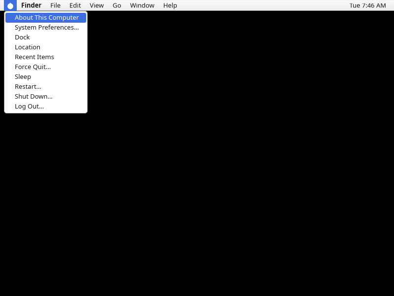). P2.5 added the **Dock**
(`AQUA_SCENE=dock`): a layer-shell BOTTOM shelf that **magnifies** under the
pointer, with running-app indicators driven by **`wlr-foreign-toplevel-management`**
(`Surface.ForeignToplevels`) and the Trash — clicking a running tile activates its
window (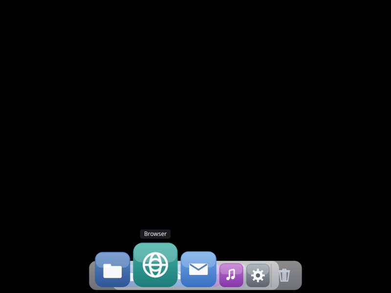). P2.6 added the **Finder**
(`AQUA_SCENE=finder`) — the first shell piece that is an ordinary xdg-shell
*application* rather than a layer surface: real `readdir` listings in an Aqua
icon grid or list view, browsing in place with a toolbar Back button, a
scrollbar, and full keyboard navigation
(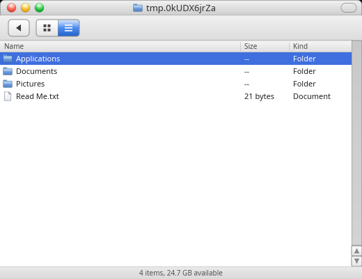). P2.7 gave the desktop its **icons**
(the boot volume + `~/Desktop`, arranged top-right-down as in Jaguar), where a
double-click opens a real Finder window
(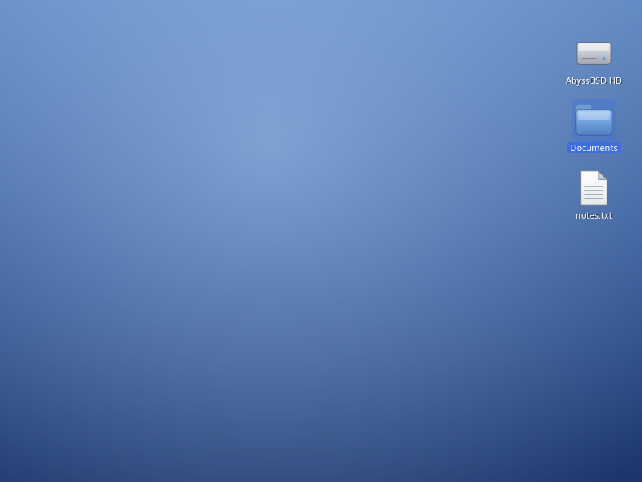). The Finder's second pass
added **spatial mode**: hide the toolbar with the title bar's pill and every folder gets its own
window, with **xdg-activation** raising one that's already open
(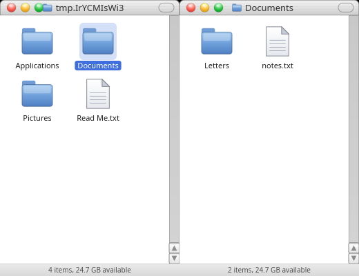) — which made the client
runtime multi-window (`Display` routes input **by wl_surface**). P2.10 tied it
together: **`abyss/session.sh`** boots the whole shell with one command — a
nested (or headless, or already-running) compositor plus the desktop, menu bar
and Dock, supervised and torn down together
(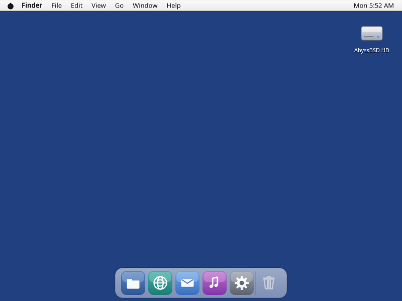). P2.11 tied off the shell's loose
ends: the Dock's **Trash** fills, opens and **empties** (right-click → Empty
Trash, the only code here that unlinks —
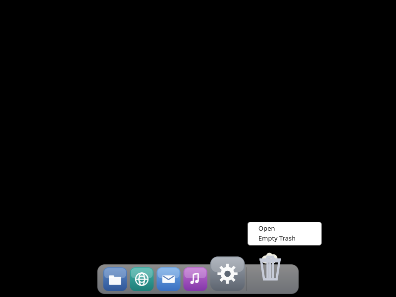), the **menu bar is fully
keyboard-drivable** (click a title, then Left/Right/Up/Down/Return/Escape), and
an **`.app` bundle is drawn with its own icon** from `Contents/Resources`
(PNG, including PNGs embedded in an `.icns`). See
[PHASE2.md](PHASE2.md) for the ordered scope.

## It runs on FreeBSD (Phase 3 — complete)

The point of the whole exercise, on the target OS — a Swift 6 desktop under
stock sway in the FreeBSD 15 build VM, captured with grim:
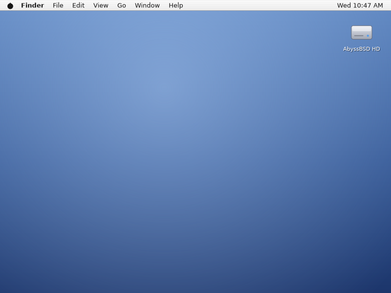
And the toolkit alone, headless with no compositor at all:
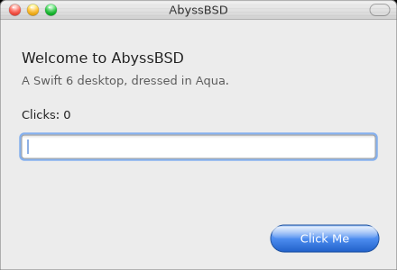

The whole **harness** passes there too — **90 unit tests and all 32 live modes**,
including pointer/keyboard injection, file operations checked on disk, and the
desktop, menu bar and Dock brought up as one session. That session is now run by
**`anchor`**, the Swift supervisor, rather than by a shell script — and the menu
bar carries real status items fed by the Swift hardware bridges:
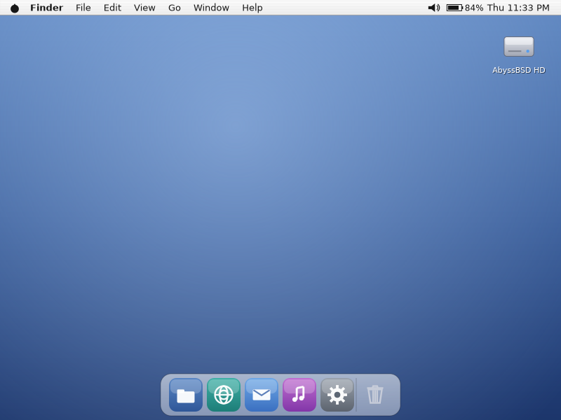

## Current state — the Aqua shell runs (Phase 1 toolkit + Phase 2 shell)

A Swift 6 package builds on Linux and renders a faithful Jaguar window
(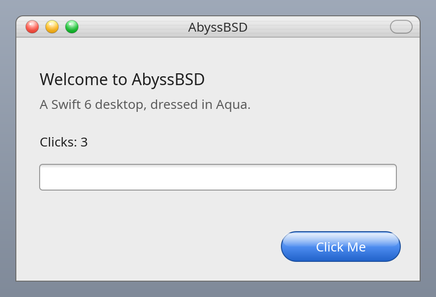 — glossy traffic lights,
gradient title bar, pinstriped content, a lickable blue gel button, HiDPI-crisp).

- **Swift 6.3.1** is installed on this Linux box; all client-side C libs are
  present (wayland-client, xkbcommon, cairo, freetype2, harfbuzz, libpng).
  `sway` (1.11) and `grim` are installed for live testing; `labwc` and `libjpeg`
  are not.
- Build: `swift build`. Tests: `swift test` (105 green — Aqua toolkit + desktop
  config + menu-bar layout + Dock magnification + the Finder's listing/geometry
  model + file ops, emptying the Trash, bundle-icon lookup and `.icns`
  extraction, self-executable resolution, PoolConfig read/write/watch, and the
  CurrentIPC codec + descriptor passing, the supervisor's restart policy, and
  the hardware bridges' parsing).
  **The same 105 pass on FreeBSD** in the build VM (`abyss/vm/build.sh`).
- The package layout (`Package.swift`, targets under `de/`):
  - `CWayland` — C interop: libwayland-client + generated **xdg-shell** + a
    shm-fd helper + a shim exporting libwayland's static-inline requests so
    Swift can call them (`de/cwayland/`). Regenerate protocols with
    `de/cwayland/generate-protocols.sh`.
  - `CCairo` — system cairo (pkgConfig), the Phase-1 software 2D backend;
    now also exposes cairo-ft for real text.
  - `CText` — real text: FreeType face management (regular + bold/italic/
    bold-italic) + HarfBuzz shaping behind a small C API (`de/ctext`), with
    `CFreeType`/`CHarfBuzz` systemLibraries supplying the pkg-config flags. Aqua
    paints the shaped run via cairo-ft, caching runs and shaping at device px.
  - `Surface` — Wayland client runtime: `Display` (connection, registry,
    globals, a poll-timeout dispatch loop with **key repeat**, per-surface
    pointer routing incl. **scroll-wheel**, `wl_output` scale tracking) + `Window`
    (xdg-shell toplevel, 2× shm buffers, frame-callback pacing, pointer input,
    per-output buffer scale) + **`LayerSurface`** (a `wlr-layer-shell` role for
    shell components — layer/anchors/exclusive-zone, its own configure/ack,
    reusing the buffer/frame/scale machinery) + `Popup` (a
    grabbing xdg-popup child surface for menus) + `Keyboard` (`wl_keyboard` +
    xkbcommon keycode→keysym/UTF-8 **plus the modifier state**, via the `CXkb`
    system module) +
    `WindowDelegate`/`LayerSurfaceDelegate`/`PopupDelegate`/`PixelBuffer`. Input
    routes to the window *or* the layer surface (one per process). Also
    `ForeignToplevels` (tracks running apps via
    `wlr-foreign-toplevel-management`, for the Dock), **xdg-activation**
    (`Display.activate(surface:)` — how a client raises its own window), and an
    `addFileDescriptor` hook to fold config-watch / timer fds into the run loop.
    `Display` holds a weak **window registry** and routes pointer/keyboard by the
    `wl_surface` the `enter` events name, so one process can run many windows
    (the spatial Finder).
  - `Aqua` — the toolkit: `Theme` (10.2 tokens), `Draw` (cairo gel buttons,
    traffic lights, gradients, pinstripe, text, and the control set: checkbox,
    radio, slider, pop-up button, progress bar, text field, group box,
    scrollbar, segmented control, tab view, modal sheet), `Text`
    (FreeType/HarfBuzz shaping via `CText`, painted through cairo-ft — with a
    cairo toy-text fallback when no font is found), `Scene`/`Widgets` (the window
    painters), `AquaWindow` (a live window wiring pointer/keyboard to the
    controls).
  - `PoolConfig` — config: read/write/watch the same `~/.config/abyss/*.ini`
    files as the Rust `pool` (mmap read, atomic-rename write, directory watch via
    the `CPoolWatch` inotify/kqueue shim). Pure syscalls, no Wayland — the shell
    components and tests use it independently (`de/poolconfig/`).
  - `CPlatform` — platform facts Swift can't reach: `ap_self_executable`
    (`/proc/self/exe` on Linux, the `KERN_PROC_PATHNAME` sysctl on FreeBSD,
    whose Swift libc module surfaces no `<sys/sysctl.h>`) and **SCM_RIGHTS fd
    passing**, since `cmsg(3)` is entirely macros.
  - `Vents` + `CVents` — the FreeBSD hardware bridges: **sysctl** (Swift's libc
    module surfaces no `<sys/sysctl.h>`, so it goes through C), the **OSS mixer**
    (`ioctl` is variadic, likewise C), the **battery** off `hw.acpi.battery.*`,
    and a **devd** reader whose fd folds into the run loop for hotplug. Every
    accessor returns nil when the facility is absent, which is what lets the
    menu bar hide a status item instead of inventing a reading. `ventsctl` reads
    them by hand.
  - `Anchor` + `anchor` — the session supervisor (`de/anchor`, `de/anchorbin`):
    starts the compositor and the shell, restarts a component that dies, and
    tears the session down as a unit. Every child is a **pollable descriptor**
    (`pdfork` on FreeBSD, `pidfd` on Linux — `de/cproc`), so it is one `poll()`
    loop carrying children, the control socket and a signal self-pipe. Drive it
    with **`abyssctl status|quit`**.
  - `CurrentIPC` — the brokerless control plane (`de/currentipc`): a typed `Msg`
    (string / u64 / bool / bytes / **fd**) with its own compact wire format, a
    `Server` on `<runtime_dir>/<service>.sock`, `connect` and one-shot `call`.
    Descriptors travel over `SCM_RIGHTS`, so a message can hand over an shm or
    dmabuf handle with no pixel copies. No Wayland, no Aqua, no platform fork —
    a Swift rewrite of the sibling's `current` that shares none of its code and,
    deliberately, not its nvlist wire format either.
  - `AquaDemo` — the runnable demo.

A **System Preferences** demo scene reproduces the Jaguar layout (toolbar with
Show All + favorites, the four category sections in order, separators, a 7-column
labeled icon grid with original procedural Aqua icons — `de/aqua/Icons.swift`):
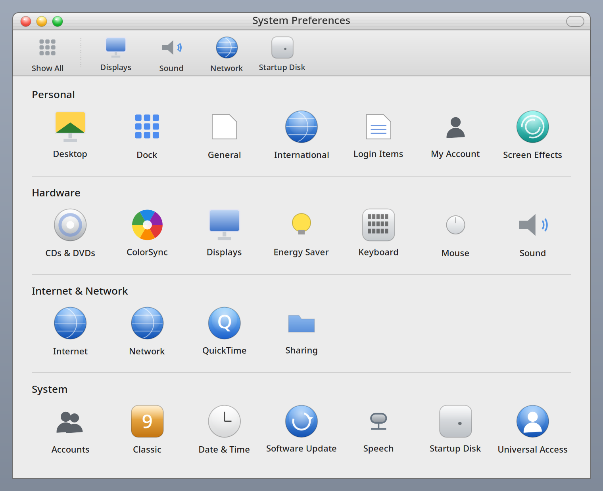

An **Aqua Controls** scene (`AQUA_SCENE=widgets`) shows the classic control set —
checkboxes, radio group, slider, pop-up button, a candy-striped progress bar and
OK/Cancel gel buttons — all interactive (`de/aqua/Widgets.swift` + `Draw`
primitives): 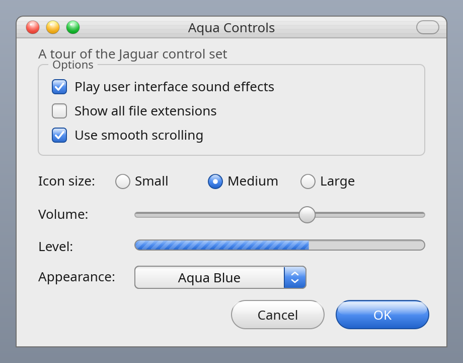

It also has full **keyboard focus/traversal**: Tab / Shift-Tab move a soft blue
focus ring through the controls (starting on the default OK button), Space
activates the focused control (toggling a checkbox or opening the pop-up menu),
the arrow keys nudge the focused slider or radio group, and Return / Escape fire
the default (OK) / Cancel buttons. Pop-up menus and the modal sheet take the
keyboard too (menu: arrow-keys + Return/Escape during its grab; sheet:
Return/Escape as default/cancel). Here Tab has walked focus to the slider (its
ring shows) after Space unchecked the first box and the arrows drove the level up:
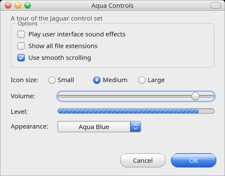

A **Scroll** scene (`AQUA_SCENE=scroll`) shows a striped list in a clipped
viewport with a working Aqua scrollbar — blue gel gumdrop thumb, paired arrows at
the bottom (Jaguar's default) — driven by thumb-drag, arrow/track clicks, and the
arrow/page/Home/End keys (`de/aqua/Scroll.swift`):
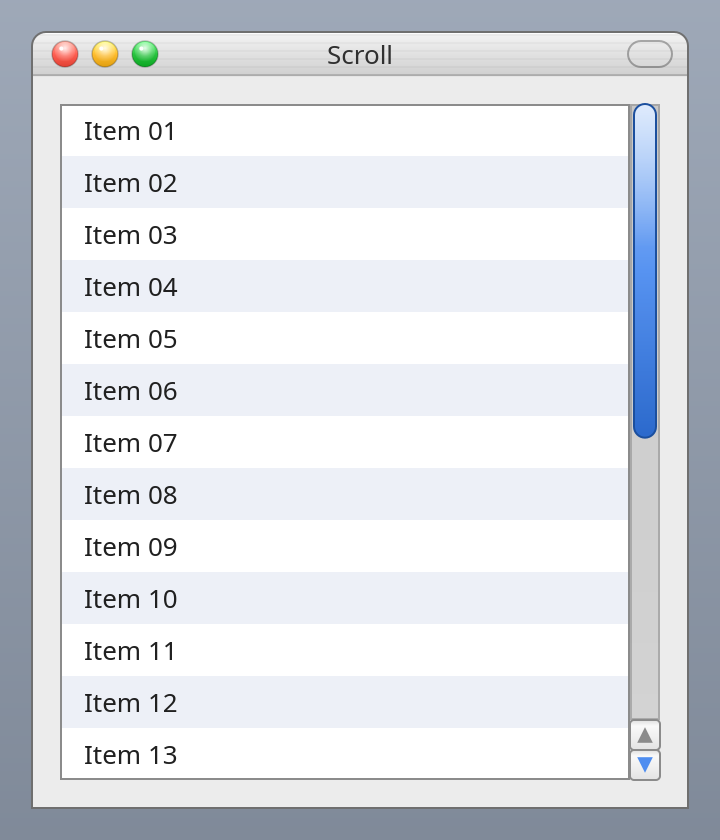

A **Tab View** scene (`AQUA_SCENE=tabs`) shows the two joined-button controls: a
segmented control (a view switcher) and a tab view whose selected tab merges into
a content pane that changes with the selection — click or arrow-key to switch
(`de/aqua/Tabs.swift`): 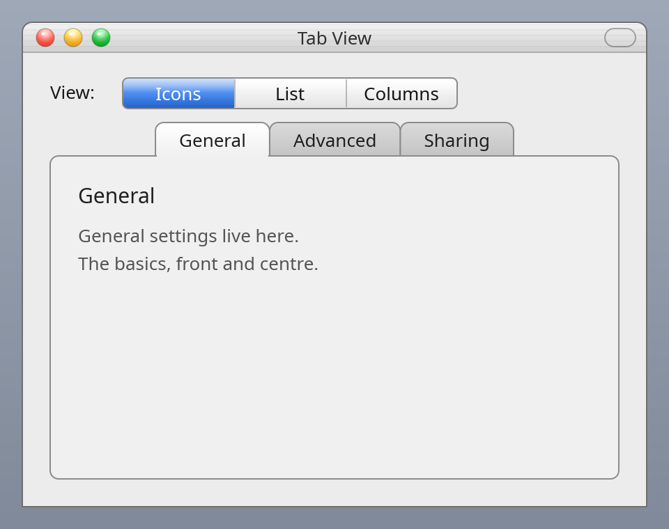

A **Sheet** scene (`AQUA_SCENE=sheet`) shows an Aqua modal sheet that slides down
from the title bar (animated), dims and blocks the parent, and dismisses via its
Cancel/Delete buttons — recording the choice below (`de/aqua/Sheet.swift`):
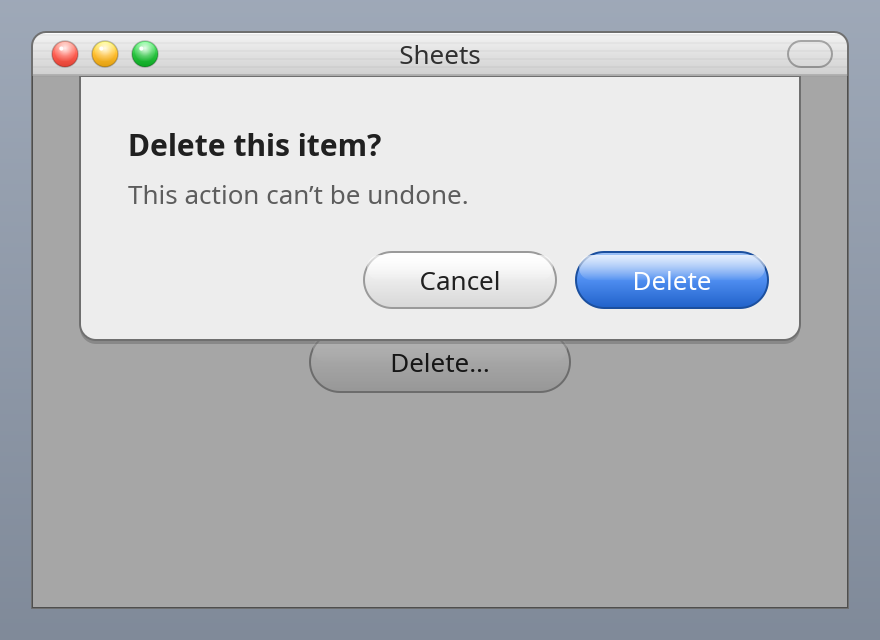

The **Finder** (`AQUA_SCENE=finder`) is the first real *application*: a Jaguar
browser window over the live filesystem — a toolbar with Back and an icon/list
view switch, a white item well with original procedural folder / document /
application / volume icons, an Aqua scrollbar, and the "12 items, 39.6 GB
available" status bar (`de/aqua/Finder.swift` + the pure `FinderModel.swift`):
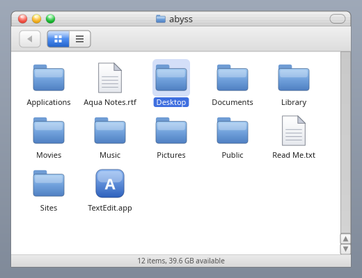 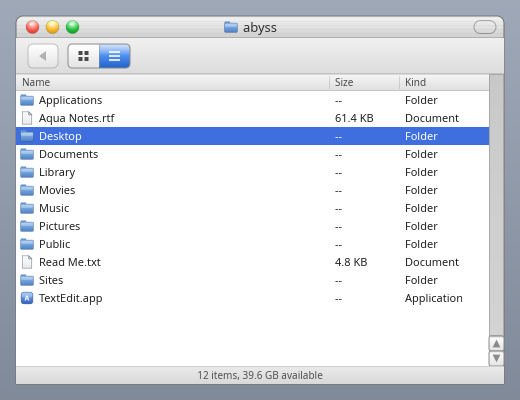

Click selects, double-click browses into a folder *in place* (the 10.2 Finder is
a browser by default — and it is standard Aqua, since brushed metal is a 10.3
texture), Back returns and re-selects the folder you came out of. Clicking the
title bar's **pill** hides the toolbar and switches to **spatial mode**, where
each folder opens in its own window, re-opening an open folder raises it (via
xdg-activation) instead of duplicating it, and the red light closes one window —
the app quits with the last. The mode persists to `finder.ini`.

(A Wayland client can't position its own windows, so the "remembered position"
part of spatial Finder waits for a compositor of our own; size/view/mode persist.)

Double-clicking something that isn't a folder **launches** it: an `.app` bundle
runs `Contents/MacOS/<name>`, an executable runs directly, and anything else goes
to the opener command (`$ABYSS_OPEN`, else `open_command` in `finder.ini`) — with
an honest "no handler" when nothing is set. The desktop icons and the **Dock**
share that path, so a Dock tile whose app isn't running launches it (another copy
of this binary in the right scene) instead of just logging.

It also **operates on files**, with the Mac's verbs rather than a PC file
manager's: **Return** renames in place (⌘O, ⌘↓ or a double-click open), **⌘⇧N**
makes a new folder and opens its name for editing with the base pre-selected,
**⌘D** duplicates, **⌘C/⌘X/⌘V** copy/cut/paste through a clipboard shared across
windows, and **⌘⌫** moves to `~/.Trash` — nothing here unlinks what you asked to
delete. Naming follows the Finder ("untitled folder 2", "Read Me copy.txt"), and
every window showing an affected folder re-reads. Here a new folder has been
created and renamed to "Reports", and Return has opened a rename on "Read Me.txt"
with just the base name selected:
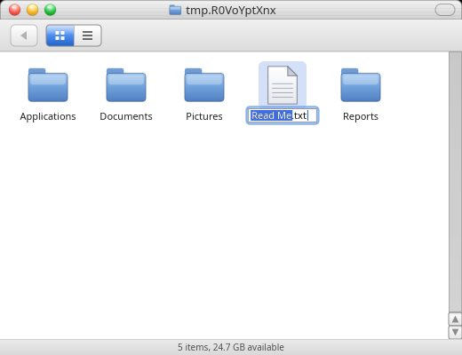
The keyboard drives it all: arrows (a whole row at a time in icon view), Home /
End, Return to open, Backspace to go up, Page keys to scroll, Tab to switch view,
and type-ahead selection. It reads `finder.ini` (`view`, `show_hidden`) and starts
in `$ABYSS_FINDER_DIR` (else `$HOME`).

The window also **tracks its output's scale** (`wl_output` + `wl_surface`
enter/leave): drop it on a HiDPI (scale-2) output and it re-cuts its buffers and
repaints crisp at 2× with no `AQUA_SCALE` — that env var is now just an optional
pin. Verified live at a scale-2 headless output (`live-sway.sh widgets --hidpi`,
a 920×720 capture of the 460×360 window):
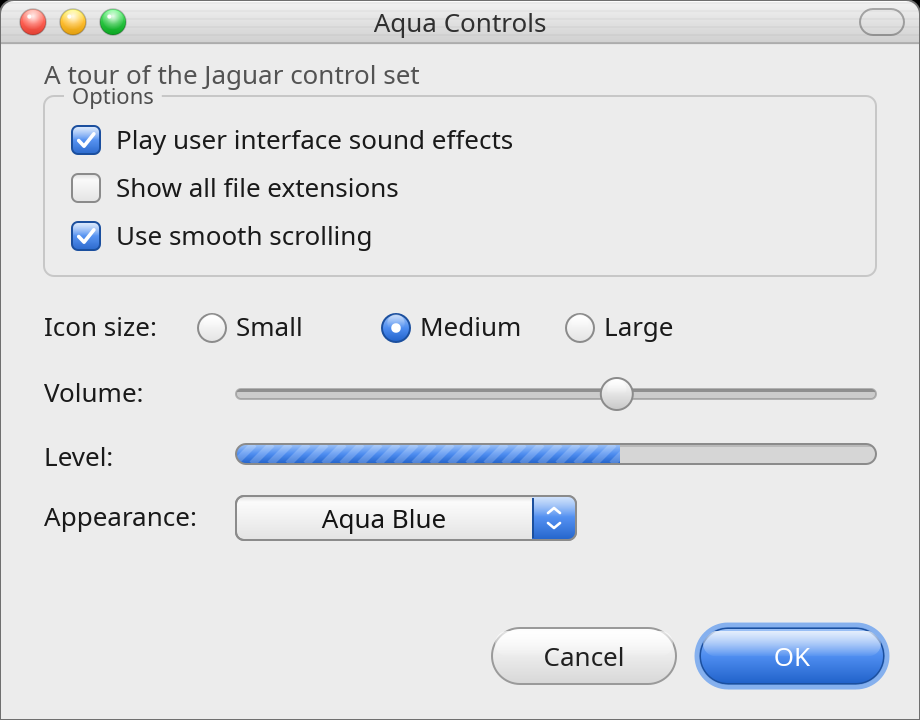

It also runs **live** now: `abyss/tests/live-sway.sh` brings the window up under
a headless sway and captures it with grim — a true test of the xdg-shell /
shm / frame-callback path the PNG render skips
(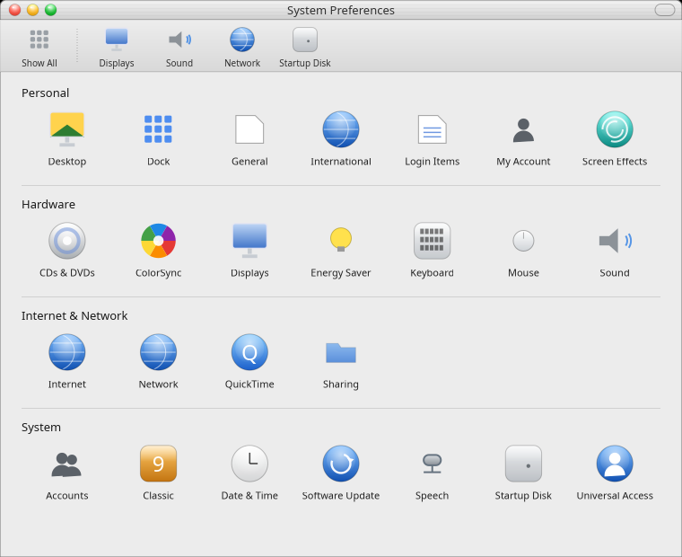). With `--click` it drives a real
pointer click through a wlr-virtual-pointer and the counter increments
(). With `--type` it drives
real keystrokes through a virtual keyboard into the window's text field
(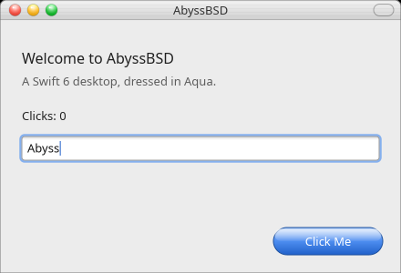) — the full `wl_keyboard` + xkbcommon
path. On the widgets scene, `--click` toggles a checkbox and moves the slider —
real pointer-driven control interaction
(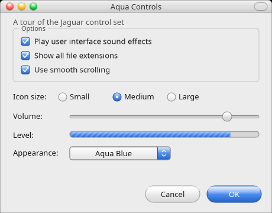). On the scroll scene it drags
the scrollbar thumb and the list scrolls to the bottom
(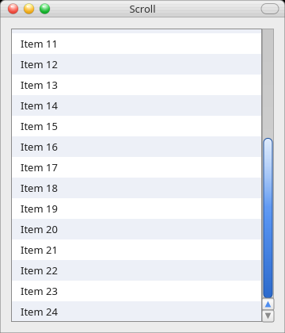). With `--menu` it opens a **real
pop-up menu** — a grabbing xdg-popup child surface — under the Appearance button,
with hover-highlight and the current item checkmarked
(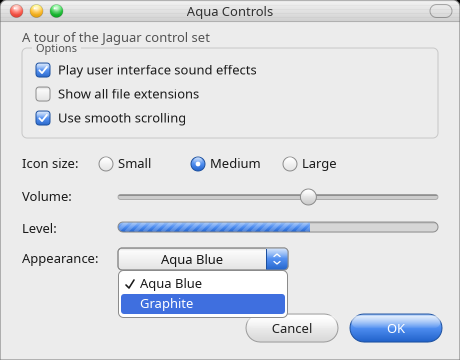); choosing an item sets the value and
dismisses. On the tabs scene it clicks the "Columns" segment and the "Sharing"
tab (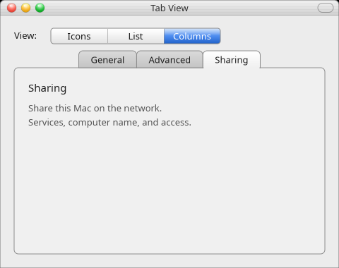). On the sheet scene it clicks
"Delete…" and the modal sheet slides out over the dimmed window
(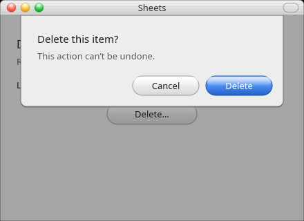). With `--wheel` it spins the scroll
wheel (`wl_pointer.axis`) and the list scrolls to the bottom without touching the
thumb (); with `--repeat` it holds one
key and the field fills with repeats — real **key repeat** off the compositor's
`repeat_info`, driven by a poll-timeout event loop
(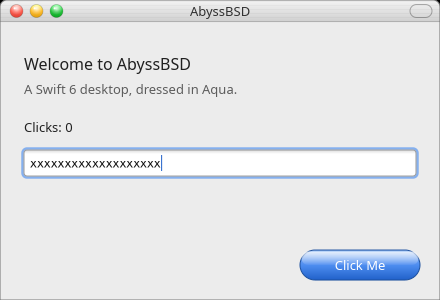).

## How to run

```sh
swift build && swift test

# The whole desktop under the Swift supervisor (the replacement for session.sh):
.build/debug/anchor --display "$WAYLAND_DISPLAY"    # or --compositor CMD
.build/debug/abyssctl status                        # ... and abyssctl quit

# The control plane between two real processes (no compositor needed; also part
# of run.sh's default lane):
abyss/tests/live-ipc.sh
abyss/tests/live-anchor.sh    # supervision: restart a killed component, quit

# Every live mode in one go (pass/fail table; -o DIR keeps the PNGs + logs):
abyss/tests/run-live.sh
abyss/tests/run-live.sh -o /tmp/shots dock trash   # ... or just some of them

# The same, on FreeBSD: sync the tree into the build VM and run there.
# (Swift lives off PATH in the guest, so use the scripts rather than ssh by hand.)
abyss/vm/check.sh          # is the guest usable? packages, pkg-config, tools
abyss/tests/run.sh --vm    # build + unit tests + smoke render, in the VM
abyss/tests/run.sh --vm --live   # ... and all 31 live modes there
abyss/vm/build.sh          # quicker: just sync + swift build + swift test
abyss/vm/build.sh --no-test -- -c release

# The whole desktop, one command (nested inside your session by default):
abyss/session.sh                       # --headless / --attach; --without dock; Ctrl-C quits
abyss/tests/live-session.sh /tmp/session.png   # ... and the live test that asserts it composes

# Headless visual check — renders one frame to PNG, no compositor needed:
AQUA_RENDER_PNG=/tmp/aqua.png AQUA_SCALE=2 .build/debug/AquaDemo
AQUA_SCENE=sysprefs AQUA_RENDER_PNG=/tmp/prefs.png AQUA_SCALE=2 .build/debug/AquaDemo
AQUA_SCENE=widgets  AQUA_RENDER_PNG=/tmp/widgets.png AQUA_SCALE=2 .build/debug/AquaDemo

# Live, against a running Wayland compositor that offers xdg-shell
# (WAYLAND_DISPLAY must be set):
.build/debug/AquaDemo                       # AQUA_SCALE=2 forces 2x; AQUA_SCENE=sysprefs

# Live smoke test under a headless sway, captured with grim (no display needed):
abyss/tests/live-sway.sh sysprefs /tmp/live.png
abyss/tests/live-sway.sh --click /tmp/click.png          # drive a real pointer click
abyss/tests/live-sway.sh --type  /tmp/type.png           # drive real keystrokes
abyss/tests/live-sway.sh widgets /tmp/widgets.png --click # toggle a checkbox + move the slider
abyss/tests/live-sway.sh scroll  /tmp/scroll.png  --click # drag the scrollbar thumb
abyss/tests/live-sway.sh --menu  /tmp/menu.png            # open a real xdg-popup menu
abyss/tests/live-sway.sh tabs    /tmp/tabs.png    --click # switch a segment + a tab
abyss/tests/live-sway.sh sheet   /tmp/sheet.png   --click # open a modal sheet
abyss/tests/live-sway.sh widgets /tmp/keys.png    --keys  # Tab/Space/arrows drive focus
abyss/tests/live-sway.sh --menu  /tmp/mkeys.png   --keys  # arrow-key the pop-up menu
abyss/tests/live-sway.sh widgets /tmp/hidpi.png   --hidpi # scale-2 output → auto 2x
abyss/tests/live-sway.sh scroll  /tmp/wheel.png   --wheel # scroll-wheel the list
abyss/tests/live-sway.sh window  /tmp/rep.png     --repeat # hold a key → it repeats
abyss/tests/live-sway.sh wallpaper /tmp/wall.png         # a layer-shell BACKGROUND wallpaper
abyss/tests/live-sway.sh --reload  /tmp/wall.png         # desktop.ini config + hot-reload
abyss/tests/live-sway.sh --menubar /tmp/mbar.png         # menu bar (TOP) + open a dropdown
abyss/tests/live-sway.sh --dock    /tmp/dock.png         # Dock (BOTTOM) magnify + foreign-toplevel
abyss/tests/live-sway.sh --finder  /tmp/finder.png       # browse a seeded dir: open, Back, list view
abyss/tests/live-sway.sh --finder --keys /tmp/fkeys.png  # ... and drive it from the keyboard
abyss/tests/live-sway.sh --spatial /tmp/spatial.png      # spatial: 2 windows, raise, close one
abyss/tests/live-sway.sh --fileops /tmp/fileops.png      # new folder/rename/copy/trash, checked on disk
abyss/tests/live-sway.sh --desktop /tmp/desk.png         # desktop icons: select, open a Finder window
abyss/tests/live-sway.sh --launch  /tmp/launch.png       # double-click an .app bundle / a document
abyss/tests/live-sway.sh --trash   /tmp/trash.png        # Dock Trash: right-click -> Empty Trash
abyss/tests/live-sway.sh --menubar --keys /tmp/mbk.png   # drive the menu bar from the keyboard alone

# Finder (an ordinary xdg-shell app) over a real directory:
ABYSS_FINDER_DIR=~/Documents AQUA_SCENE=finder .build/debug/AquaDemo

# Wallpaper (layer-shell) PNG preview, no compositor:
AQUA_SCENE=wallpaper AQUA_RENDER_PNG=/tmp/wall.png .build/debug/AquaDemo
# Config-driven live: point AquaDemo at a config dir with a desktop.ini
ABYSS_CONFIG_DIR=~/.config/abyss AQUA_SCENE=wallpaper .build/debug/AquaDemo
```

## Conventions (inherited from the sibling, adapted to Swift)

- **Minimal third-party deps.** New capability = hand FFI to a mature C system
  library (or vendored C), not a SwiftPM registry dep. See `CWayland`/`CCairo`.
- **Wrap in phase 1, rewrite in Swift later.** e.g. cairo now; a Swift/GPU
  renderer later.
- **The static-inline trap:** every `wl_*` request and `*_add_listener` is
  `static inline` and invisible to Swift — add a one-line `aw_*` wrapper in
  `de/cwayland/cwayland_shim.c` (and a decl in `cwayland.h`) and call that.
- **Listener lifetime:** libwayland keeps the listener pointer; `Display`
  heap-allocates each listener struct and frees them in `deinit`. Pass the owner
  via `Unmanaged.passUnretained(...).toOpaque()` as the `data` arg.

## What's next

Phases 0–2 are complete (Phase 2: layer-shell + Desktop, `PoolConfig`, menu bar,
Dock, Finder — browser *and* spatial, with file operations — desktop icons,
launching, the one-command session, and the shell polish; P2.9 `CurrentIPC` was
decided rather than built, and carried to Phase 3). See [HANDOFF.md](HANDOFF.md)
§5 for the reasoning; in short:

- **Shell polish:** the self-contained ones shipped in P2.11 (empty the Trash,
  menu-bar keyboard navigation, bundle icons). Left: dragging desktop icons —
  blocked on the same protocol limit as spatial window placement, since a
  Wayland client can't position itself, so it needs remembered per-item
  positions in config — the menu bar's status items (they need the FreeBSD
  hardware bridges, Phase 3), and a confirmation sheet for Empty Trash once a
  layer surface has somewhere to host a dialog.
- **Golden-image tests:** snapshot the deterministic PNG scenes and diff in CI.
- **Phase 3 — FreeBSD**, scoped in **[PHASE3.md](PHASE3.md)** (passes P3.1–P3.7)
  and **COMPLETE: P3.1–P3.7 all shipped.** The Jaguar desktop runs on FreeBSD
  under a Swift session supervisor, with a Swift control plane and Swift hardware
  bridges underneath; the whole harness passes there (105 unit tests + 33 live
  modes); and the project's #1 risk is closed.
  The build VM (`../abyss-swift-vm`, FreeBSD 15.0-RELEASE-p11) provisions from a
  corrected cloud-init seed and is asserted usable by `abyss/vm/check.sh`
  (P3.1). **FreeBSD ports carries `swift6-6.3.2`** — newer than the 6.3.1 we
  build with here — and it **builds this repo and passes all 63 tests in the
  guest** (P3.2), for one `Package.swift` change and no source changes. The old
  seed's `pkg install -y swift` was a false negative: the package is named
  `swift6` and lives off PATH at `/usr/local/swift6/bin`
  (`ABYSS_GUEST_SWIFT_BIN`). `abyss/vm/build.sh` is the dev loop — sync, build
  and test in the guest in one command. [SWIFT-ON-FREEBSD.md](SWIFT-ON-FREEBSD.md)
  is now closed. P3.3 then ran it: the window headless with no compositor, and
  the desktop live under sway + grim. Every portability debt is paid — the last,
  `/proc/self/exe`, became the **`CPlatform`** shim (`KERN_PROC_PATHNAME`;
  Swift can't see `<sys/sysctl.h>` on FreeBSD at all) — and one bug turned up
  that only existed there: the font style lists carried Linux paths only, so
  **bold and italic text silently fell back to regular**. P3.4 got the harness
  green in the guest — all 31 live modes and the supervised session — behind two
  platform fixes (FreeBSD sets no `XDG_RUNTIME_DIR`, and its `od(1)` adds a
  trailing space that broke the pixel probes), and added
  `abyss/tests/run-live.sh` plus a `run.sh --vm` lane. P3.5 built **`CurrentIPC`**
  (`de/currentipc`): the brokerless control plane — typed messages over unix
  sockets with **`SCM_RIGHTS` descriptor passing**, our own compact codec rather
  than FreeBSD's libnv (P2.9's call, and it means the component has no platform
  fork at all). P3.6 replaced `abyss/session.sh` with **`anchor`**, the Swift
  session supervisor: every child is a pollable descriptor (`pdfork` on FreeBSD,
  `pidfd` on Linux), so supervision is one `poll()` loop that also carries the
  control socket and a signal self-pipe — with `abyssctl status|quit` driving it.
  P3.7 finished the substrate with **`Vents`**, the hardware bridges — sysctl
  (not sysfs), OSS (not ALSA), devd (not udev) — and the menu bar's volume and
  battery status items. The remaining Phase-3 work was always someone else's
  phase: all
  **Swift rewrites** with the sibling's crates read as the spec: `CurrentIPC`
  (PHASE2.md P2.9), a session supervisor (replacing `abyss/session.sh` and the
  launcher's double-fork stand-in), and the hardware bridges behind the menu
  bar's status items. The shell keeps running on stock sway/labwc from ports
  until a Swift compositor exists (its own later phase); portals and the legacy
  D-Bus bridge are carved out to a phase of their own.
