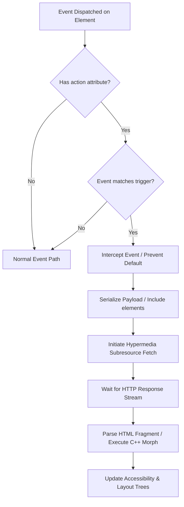

# Native HTML5 Hypermedia Extension (Browser-Level Specification)

> Status: a design exploration, captured into the repo from an earlier draft.
> It defines the distinguishing bet of the AbyssBSD web browser
> (`BACKLOG.md` → Web browser): native hypermedia in the rendering engine, and
> first-class zero-JavaScript apps. Not committed, and not yet reconciled with
> the open questions recorded at the end.

This specification defines the native implementation of a **Hypermedia Engine** directly within a web browser's core rendering engine (e.g., WebKit, Blink, or Ladybird's LibWeb). Rather than using JavaScript shims (like HTMX or Hotwire) to hijack events and issue fetches, this proposal extends HTML, DOM, and networking specifications at the browser standard level.

---

## 1. Web IDL & DOM API Extensions

To expose hypermedia attributes natively to the DOM and script engines, we extend `HTMLElement` with the following IDL definitions:

```webidl
partial interface HTMLElement {
    [CEReactions] attribute USVString? action;
    [CEReactions] attribute DOMString? method;
    [CEReactions] attribute DOMString? trigger;
    [CEReactions] attribute DOMString? target;
    [CEReactions] attribute DOMString? swap;
    [CEReactions] attribute DOMString? include;
    [CEReactions] attribute DOMString? loading;
    [CEReactions] attribute DOMString? loadingClass;
    [CEReactions] attribute boolean pushUrl;
};
```

- When the browser parser encounters elements with these attributes, it populates the corresponding internal properties on the C++ DOM node (`Element` class).
- Modifying these properties via JavaScript will instantly trigger `attributeChangedCallback` logic inside the browser engine, updating their active event bindings.

---

## 2. Browser Event Loop & Trigger Pipeline

Instead of full-page navigation, any element carrying an `action` attribute can trigger a **Partial DOM Update**. 

### Interception Path
Within the browser’s event dispatching flow (e.g., `EventDispatcher::dispatch` in WebKit/Blink or `DOM::EventTarget::dispatch_event` in Ladybird):
1. When an event fires on an `Element`, the engine checks if the target element (or its bubble path) has a valid `action` attribute.
2. If `action` is present, the engine parses the `trigger` attribute to determine if the event matches.
   - **Default triggers**:
     - `FORM`: `submit`
     - `INPUT`, `TEXTAREA`, `SELECT`: `change`
     - All other elements: `click`
3. If matched, the engine executes the default behavior handler, which:
   - Prevents standard navigation or form submission (`event.preventDefault()`).
   - Initiates a **Hypermedia Subresource Fetch**.



---

## 3. Network Fetch Protocol & HTTP Headers

When sending a native hypermedia request, the browser's loader (e.g., `ResourceFetcher` in Blink) formats a new subresource request to prevent full page reloads:

### Outgoing Browser Headers
The browser automatically appends native headers to inform the backend of the client state:
- `Sec-Hypermedia: true` — Flags that this is a native hypermedia request.
- `Sec-Hypermedia-Target: <selector>` — The target DOM element selector.
- `Sec-Hypermedia-Trigger: <id-or-tag>` — The ID or tag of the triggering element.
- `Accept: text/html;fragment=true, text/html` — Requests HTML fragments rather than complete documents.

### Incoming Server Control Headers
The server can control browser behavior using response headers:
- `Sec-Hypermedia-Redirect: <url>` — Directs the browser to perform a full page navigation (redirect).
- `Sec-Hypermedia-Push-Url: <url>` — Updates the browser's URL address bar and history.
- `Sec-Hypermedia-Refresh: true` — Forces a full page reload.
- `Sec-Hypermedia-Trigger: <event-name>` — Dispatches a native DOM event on the client.

---

## 4. Native DOM Morphing (C++ Layout Engine)

Traditional `innerHTML` replacement destroys child element states (input focus, text selections, scroll positions, active CSS transitions). To solve this natively, the browser layout engine implements a C++ **DOM Morphing Algorithm** (similar to Virtual DOM reconciliation but executed directly on the live DOM tree in C++):

1. **Fragment Parsing**: The browser parses the incoming HTML chunk using its native HTML Parser into a detached `DocumentFragment` object.
2. **Reconciliation**: The engine diffs the `target` node in the active DOM tree against the parsed fragment:
   - **Attribute updates**: Synced directly by adding/removing attributes.
   - **Text modifications**: Text nodes have their data replaced in-place, preventing layout reflow of unrelated sibling text nodes.
   - **Node insertion/removal**: Nodes are appended, inserted, or removed using native DOM actions.
   - **Input tracking**: Active input elements matching by ID/Name are patched (updating value properties without losing focus or cursor selection).
3. **View Transitions Integration**: If supported, the engine wraps the morph within a View Transition (`document.startViewTransition`), smoothly animating layout changes using CSS pseudo-elements.

---

## 5. Security & CSP Model

One of the largest benefits of a native hypermedia implementation is security. 
- **Zero-JS Web Applications**: A browser running a hypermedia app can set a Content Security Policy (CSP) of `script-src 'none'`.
- Since the DOM updates, request routing, and event handling are native browser actions rather than JS frameworks, standard XSS (Cross-Site Scripting) vectors are completely eliminated.
- Custom actions are bound strictly by CORS and same-origin policies, just like forms and anchors.

---

## 6. Native Accessibility Tree (A11y) Integration

Modern JS frameworks often break accessibility when changing the DOM because they don't update screen readers correctly. A native browser implementation natively updates the Accessibility Tree (`AXObjectCache` in Blink/WebKit) during hypermedia swaps:
- When a target element is morphed, the engine updates its corresponding `AXObject`.
- Focus is automatically adjusted: if a focused element is replaced or deleted, the browser moves the system accessibility focus to the nearest parent container or the new swapped node.
- The browser natively manages standard ARIA announce behavior for swapped elements based on `aria-live` attributes.

---

## 7. Engine Patch Blueprint (Ladybird / LibWeb Case Study)

To prototype this in a modular engine like **Ladybird**, changes would be localized to the following modules in `Userland/Libraries/LibWeb`:

1. **IDL Declarations (`DOM/HTMLElement.idl`)**:
   Add attributes so they compile into the JS bindings and C++ classes.
   
2. **Element Properties (`DOM/HTMLElement.h` and `DOM/HTMLElement.cpp`)**:
   Store the underlying values for `m_action`, `m_method`, etc. Implement attribute change listeners:
   ```cpp
   virtual void attribute_changed(FlyString const& name, Optional<String> const& value) override {
       HTMLElement::attribute_changed(name, value);
       if (name == "action") {
           // Register event listeners based on trigger attribute
       }
   }
   ```

3. **Event Interception (`DOM/EventTarget.cpp`)**:
   Intercept events in the dispatch routine:
   ```cpp
   bool EventTarget::dispatch_event(NonnullRefPtr<Event> event) {
       // Check target element for custom hypermedia actions
       if (has_hypermedia_action(event)) {
           trigger_hypermedia_fetch(event);
           return false; // prevent default browser handling
       }
       return EventTarget::dispatch_event_impl(event);
   }
   ```

4. **Response Insertion (`HTML/Parser/HTMLParser.cpp`)**:
   Parse fragments and pipe them into the DOM tree reconciler using a new C++ DOM diffing class (`DOM/DOMMorpher.cpp`).

---

## Open questions

Recorded when this spec was brought into the repo; to be resolved before the
extension is load-bearing.

- **Attribute naming collides with existing HTML.** `action` and `method` are
  already `<form>` attributes, `target` is on `<a>`/`<form>`/`<base>`
  (`target="_blank"`), and `loading` is on ``/`<iframe>` — four of the
  nine attributes in §1 clash. Bare names make markup ambiguous
  (`<a target="#result">` — a selector, or a browsing context?). The htmx
  `hx-*` prefix and the W3C `data-*` namespace exist precisely to avoid this;
  the extension should adopt a prefix (`hm-action`, `hm-target`, …) or
  `data-hm-*`. `pushUrl` and `loadingClass` should also be lowercase content
  attributes (`push-url`) whatever their IDL property names.
- **It is an extension, not "standard HTML5."** The browser is
  standards-compliant *plus* a hypermedia extension that, until standardized,
  is AbyssBSD's own. The mitigation is graceful degradation — unknown
  attributes are inert — so every hypermedia control should also be a working
  plain `<form>` or `<a>`: progressive enhancement, not a fork of the web.
